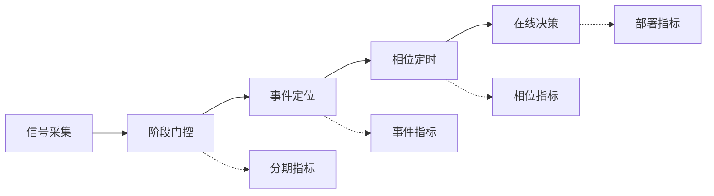

# 综述正文 v14 草案（2.2–6.5）

本稿完整继承[[review/综述正文v13草案-2.2至6.5]]的正文、3.2四层改写、邻近技术证据分层、证据边界、研究主归属及全部待补项，仅依据[[review/第5章与第2-3章定量重复审计表]]重构第5章；其余章节正文原样继承。本稿为待确认版本，不自动并入[[review/综述正文草案]]，也不自动同步TeX。

## 2.2 实时睡眠分期与瞬时相位估计技术

### 2.2.1 阶段、事件与相位任务边界

闭环睡眠干预的识别层可按阶段、事件和相位三个时间尺度组织，形成从状态门控到局部事件定位再到周期内定时的递进链条。阶段级输出决定系统是否进入刺激候选窗口，事件级输出定位纺锤波或慢波等局部波形，相位级输出进一步确定单个振荡周期内的刺激时点。相应地，阶段分期以人工PSG标签为参考，事件检测关注事件匹配规则与假阳性率，相位估计则需要离线参考相位、圆周统计和刺激到达时间共同描述。[[source-pages/esfahani-2023-closed-loop-auditory-principles]]（PDF第2–4页）；[[source-pages/warby-2014-spindle-benchmark]]（全文RESULTS与METHODS）；[[source-pages/ferster-2022-real-time-phase-algorithms]]（PDF第1–2、7页）

如图2-X所示，本节后续内容沿“信号采集—阶段门控—事件定位—相位定时—在线决策”的链条展开，并将分期、事件、相位和部署指标分别对应到不同识别层级。

**图2-X 实时睡眠识别任务链。** 识别层由信号采集、阶段门控、事件定位、相位定时和在线决策构成；各环节分别对应分期、事件、相位和部署层面的评价指标。

阶段标签是由评分规则、信号导联和人工一致性共同塑造的约定参考。R&K与AASM在阶段定义和S3/S4合并上存在差异，人工评分还会呈现跨评分者、跨实验室和逐阶段差异，N1等过渡阶段通常更难取得一致。AASM评分体系随手册版本和应用场景更新而调整，算法研究中的阶段标签由此带有明确的规则版本和评分流程属性。[[source-pages/danker-hopfe-2009-rk-aasm-reliability]]（PDF第1–9页）；[[source-pages/danker-hopfe-2004-eight-labs-reliability]]（PDF第1–6页）；[[source-pages/berry-2015-aasm-v2-2-updates]]（PDF第1–2页）

### 2.2.2 公开数据集、标签体系与验证协议

数据集来源、标注体系和验证划分共同决定算法结果的可解释范围。阶段分期资源主要包括Sleep-EDF、SHHS、MESA和ISRUC-Sleep；MASS也包含阶段任务，本节直接证据主要涉及其纺锤子集。微结构资源包括CAP Sleep、DREAMS、MASS和MODA。闭环刺激研究多依赖各研究自有数据，统一公开基准的关键字段包括真实可穿戴原始EEG、精确刺激到达时间戳、设备分项延迟和刺激后响应。相关字段见[[review/2.2公开数据集、标签体系与验证协议比较表]]。

| 数据资源 | 证据用途 | 标签与协议特征 | 在线因果评测适用性 |
| --- | --- | --- | --- |
| [[dataset/Sleep-EDF]] | 单导五分类、subject-wise与跨库测试 | R&K及N3/N4映射；版本和清醒截取方案影响样本构成 | 适合时序回放和离线泛化分析 |
| [[dataset/SHHS]] | 大规模PSG和外部验证 | 应用筛选样本与全量队列分开 | 适合多中心PSG域外部验证 |
| [[dataset/MESA]] | 多民族/跨人群与多模态候选 | 直接应用证据以PPG为主，EEG闭环需连接额外证据 | 适合跨人群与多模态候选分析 |
| [[dataset/ISRUC-Sleep]] | 临床多模态五分类候选 | 已核验应用集中于ISRUC-S3 | 适合离线双向模型验证 |
| [[dataset/MASS]]、[[dataset/DREAMS]]、[[dataset/MODA]] | 纺锤事件检测、外部测试和专家共识 | 标注者、OR/AND起点、片段长度和共识规则影响事件标签 | 适合事件检测回放 |
| [[dataset/CAP Sleep]] | 病理人群与微结构候选 | 已纳入应用为24人PPG子集 | 适合病理人群与微结构邻近回放 |

Sleep-EDF上的模型结果受20人/78人版本、R&K映射、清醒期截取和epoch-wise或subject-wise划分影响；SHHS上的大样本结果主要反映多中心PSG域表现。SleepTransformer分别在SHHS和Sleep-EDF-78报告结果，两库结果展示了同一模型在不同数据条件下的实例化表现，也提示跨库比较需要同时交代数据构成、标签和划分方式。[[source-pages/phan-2022-sleeptransformer]]（PDF第2、5–8页）；[[source-pages/liu-2023-micro-sleepnet]]（PDF第3–8页）

验证协议的核心差异在于划分单位。随机epoch划分考察片段级识别，subject-wise、LOSO和跨数据集测试更接近新受试者泛化；使用未标注目标域数据训练的UDA则反映目标域可接触条件下的适配能力。Bresch采用按受试者三折并进行SIESTA跨库测试，Mikkelsen采用LOSO，Gao比较跨数据集UDA。[[source-pages/bresch-2018-real-time-rnn-staging]]（PDF第3、8–9页）；[[source-pages/mikkelsen-2019-around-ear-rf-staging]]（PDF第3–10页）；[[source-pages/gao-2023-domain-adversarial-staging]]（PDF第5–9页）这些协议共同构成从片段识别、跨受试者泛化到跨域适配的验证梯度。[[source-pages/van-der-donckt-2023-traditional-ml]]（PDF第1–8页）

### 2.2.3 阶段级表征与上下文模型

阶段级算法可沿“epoch内表征—epoch间上下文—输出后处理”比较。手工特征路线把频谱和特征波形交给浅层分类器，变量含义较清楚，同时也把设备频响、特征提取和个体校准纳入结果解释。Mikkelsen在耳周EEG上使用随机森林并按LOSO验证；中文Sleep-EDF研究提取K复合波及多个频段功率谱密度，最高accuracy为91.94%，macro-F1为73.2%。两项研究共同说明，手工特征模型仍是可解释、低复杂度分期路线的重要参照。[[source-pages/mikkelsen-2019-around-ear-rf-staging]]（PDF第1、3–10页）；[[source-pages/gao-2023-psd-random-forest]]（PDF第1、4–6页）

深度模型可从原始波形或时频图学习epoch内表征。SleepEEGNet以CNN编码后接双向RNN与注意力，TinySleepNet以原始单导EEG和轻量时序结构控制复杂度；中文迁移研究把EEG转换为二维时频图，中文单导DCNN-BiLSTM则联合时频表征与序列建模。原始波形、手工特征和时频图分别对应不同的归一化、增强和计算成本设置，使阶段级模型比较同时涉及输入表征、架构和部署条件。[[source-pages/mousavi-2019-sleepeegnet]]（PDF第1、4–11页）；[[source-pages/supratak-2020-tinysleepnet]]（PDF第1–4页）；[[source-pages/tian-2023-transfer-sdresnet]]（PDF第1、6–8页）；[[source-pages/zhang-2023-single-channel-dcnn-bilstm]]（PDF第1、5–7页）

epoch间上下文用于刻画睡眠阶段转移结构，上下文方向则决定模型面向离线评分还是在线控制。SeqSleepNet、SleepEEGNet以及中文BiGRU/BiLSTM模型使用双向序列结构，展示了未来epoch信息对离线上下文建模的价值。[[source-pages/phan-2019-seqsleepnet]]（PDF第3–8页）；[[source-pages/liu-2023-psg-bigru-attention]]（PDF第1、6–8页）；[[source-pages/zhang-2023-single-channel-dcnn-bilstm]]（PDF第1、5–7页）SleepTransformer使用完整序列注意力，FlexSleepTransformer支持不同通道组合和混合数据训练；中文混合注意力模型融合片段内时间、通道和片段间上下文。这些研究共同呈现了上下文建模、通道适配和混合数据训练三条阶段级表征路线。[[source-pages/phan-2022-sleeptransformer]]（PDF第3–9页）；[[source-pages/guo-2024-flexsleeptransformer]]（PDF第4–12页）；[[source-pages/jin-2021-hybrid-attention-staging]]（PDF第1、5–7页）

状态空间模型为有限状态更新和长序列效率提供候选。MultiSEss把多尺度卷积、SE注意力和SSM用于EEG五分类，现有证据集中在离线性能与消融分析；面向闭环部署时，还需要把因果配置、状态缓存、端侧内存、功耗和真实流式时延纳入同一评价框架。[[source-pages/huang-2025-multisess]]（PDF第4–12页）无EEG双向Mamba仅作为第5.4节登记的邻近技术证据；它不能进入因果EEG模型排名，也不承担EEG事件或相位控制结论。[[source-pages/zhang-2026-mamba-wearable-staging]]（PDF第1、5–9页）

### 2.2.4 事件检测与相位预测算法

事件检测以稀疏波形为对象，评价体系由sample-wise与event-wise口径、事件重叠阈值和时间容差共同构成。Warby等以110名健康受试者的N2期C3-M2数据和24名专家建立群体共识，展示了专家共识、OR/AND起点规则和事件边界对算法评价的影响。[[source-pages/warby-2014-spindle-benchmark]]（全文RESULTS与METHODS）SpindleNet以250 ms移动窗输出纺锤概率，专家OR/AND起点规则会改变检测延迟；Portiloop将FIR、ANN概率、阈值和声音控制器连接为端侧工程链。事件检测的核心指标包括event-wise precision、recall、F1、假阳性/小时、起点/峰值/终点误差，以及波形形成等待对检测延迟的贡献。[[source-pages/kulkarni-2019-real-time-spindle-detection]]（HTML §2.1–2.3、§3.3）；[[source-pages/valenchon-2022-portiloop]]（PDF第1–4、8–9、13–15页）

实时相位估计是在未来信号未知时推断当前振荡位置，核心问题是因果滤波、相位预测和刺激延迟补偿。Ferster在同一慢波基准内比较幅度阈值、PLL和相位声码器；Santostasi验证PLL探索性人体刺激，Piorecky比较固定补偿与PLL。这些研究把参考相位、导联、人群、幅度门控和圆周统计共同纳入相位算法评价。[[source-pages/ferster-2022-real-time-phase-algorithms]]（PDF第1–2、7页）；[[source-pages/santostasi-2015-pll-acoustic-stimulation]]（HTML Results 3.3–3.4）；[[source-pages/piorecky-2021-real-time-slow-oscillation]]（PDF第6、12–20页）

预测型路线通过外推补偿处理和刺激延迟。Zrenner的实时EEG触发TMS提供AR相位预测的邻近方法证据；Bressler的可穿戴系统以逐样本ecHT追踪入睡前alpha相位，并依据生理潜伏期设置声音起始相位。二者分别为相位预测和可穿戴相位控制提供方法参照，完整评价还涉及统一设备时钟下的采集、滤波、预测、通信和刺激实际到达时间。[[source-pages/zrenner-2020-real-time-eeg-tms-phase]]（PDF第1–7页）；[[source-pages/bressler-2023-wearable-eeg-closed-loop]]（PDF第3–5页）

### 2.2.5 在线因果性、跨域泛化与个体化

严格在线性涉及预处理、网络结构、后处理和运行系统等多个层级。Patanaik可以在线返回阶段，离线修正使用未来输出，在线版本以历史替代，声音示例还采用时间正反向滤波；Bresch明确使用单向CNN-LSTM因果架构，主要结果来自离线实验。[[source-pages/patanaik-2018-end-to-end-real-time-sleep-staging]]（PDF第3–5页）；[[source-pages/bresch-2018-real-time-rnn-staging]]（PDF第2–5、8–10页）这些研究把“因果架构”“在线回放”“设备端推理”和“真实人体在线系统”区分为不同证据层级。

DistillSleep、Hsieh和Esparza-Iaizzo分别补充单导端侧蒸馏、眼罩—BLE—移动端链路以及OSA/非OSA实时监测用途；中文双通道系统和无线可穿戴EEG研究补充本土在线工程路径。[[source-pages/park-2025-distillsleep]]（PDF第1–12页）；[[source-pages/hsieh-2021-eyemask-real-time-staging]]（PDF第2–9页）；[[source-pages/esparza-iaizzo-2026-real-time-scoring]]（PDF第1–10页）；[[source-pages/wu-2023-dual-channel-online-staging]]（PDF第1–10页）；[[source-pages/kang-2024-wireless-wearable-eeg-system]]（PDF第1–5页）这些研究共同描绘了从模型压缩、可穿戴采集、无线通信到移动端推理的部署链条。Micro SleepNet在Android上报告约100 KB和约2.8 ms单条输入推理；闭环整链评价还需连接30 s窗口形成、采集、预处理、通信、决策和刺激执行。[[source-pages/liu-2023-micro-sleepnet]]（PDF第2、8–10页）

跨域与个体化研究包含训练时接触目标域、少量校准和完全外部测试等不同设置。跨数据集UDA说明域适应价值，可穿戴系统则进一步引入跨导联、跨设备、跨夜和个体校准问题。[[source-pages/gao-2023-domain-adversarial-staging]]（PDF第5–9页）现有证据已经覆盖跨被试、跨数据集与部分端侧实现，后续关键环节是跨设备稳定性和多夜个体化。

输出层可以从概率校准、错误排序、选择性拒绝和人工复核四个角度组织。Hong复核最低置信度20%的epoch后总体accuracy由约76%提高至87%，展示了置信度排序与人工协作的潜在价值；U-PASS与van Gorp进一步提供不确定性和专家协作框架。[[source-pages/hong-2021-confidence-based-scoring]]（PDF第1、7–9页）；[[source-pages/heremans-2024-upass]]（PDF第1–10页）；[[source-pages/van-gorp-2022-uncertainty-framework]]（PDF第1–6页）SwSleepNet的online calibration通过短片段不一致后的上下文重判改善输出一致性，与ECE、Brier score或可靠性图所描述的概率校准构成不同层面的输出后处理。[[source-pages/zhu-2024-swsleepnet-online-calibration]]（PDF第1、3–9页）

面向闭环应用的识别评价可由四组指标构成：分期accuracy、balanced accuracy、macro-F1、逐期precision/recall/F1、Cohen's kappa和混淆矩阵；校准Brier score、ECE及可靠性曲线；拒绝输出coverage、selective risk和拒绝触发率；泛化subject-wise、LOSO、cross-dataset、cross-center和cross-device。统计上宜以受试者为基本汇总单位并报告置信区间和最差亚组，以补充全epoch池化结果。事件和相位任务还需分别报告event-wise误差、假阳性/小时、圆周误差、离散度和目标窗命中。[[review/2.2公开数据集、标签体系与验证协议比较表]]这些指标构成闭环识别研究的理想报告框架；Brier/ECE、selective risk、cross-device及按被试置信区间是后续证据补齐的重点。

综上，2.2节将实时睡眠识别技术概括为阶段门控、事件定位、相位定时、在线部署和跨域个体化五个相互衔接的层级。同一数据、同一标签、同一划分和同一运行模式内的方法结果具有较强可比性；跨数据集比较的解释重点在于标签、设备、人群和协议差异。后续证据补齐可集中于随机epoch与subject-wise的同模型直接定量比较、跨设备稳定概率校准、整夜功耗/续航与采集至刺激总时延，以及不同评分手册版本下成人分期规则差异对算法可比性的系统整理。[[review/2.2逐句证据审计与放行报告]]正式证据池与逐项可比性见[[review/2.2正式证据池与统一算法比较表]]；证据包见[[review/证据包/02-技术基础-2.2-P1-证据包]]。
## 2.3 闭环系统的延迟与精度

闭环系统的实时性可以拆解为一条明确起止点的时间链。本文将总时延表述为窗口或生理事件形成时间、采集、缓冲、预处理、推理、决策、通信、刺激设备执行和刺激物理到达的组合；编程补偿间隔和听觉诱发反应等生理潜伏期作为独立时间变量登记。[[source-pages/esfahani-2023-closed-loop-auditory-principles]]（PDF第3页）；[[review/2.3形式化指标与系统比较表]] 在这一框架下，“模型运行5 ms”“检测后等待350 ms”和“约62 ms生理补偿”分别对应局部计算、控制参数和生理响应时标，可共同用于描述闭环链路的不同环节。[[source-pages/piorecky-2021-real-time-slow-oscillation]]（PDF第6、12–20页）；[[source-pages/bressler-2023-wearable-eeg-closed-loop]]（PDF第3–5页）

阶段级门控的时间结构由输入窗口、状态确认和在线更新节律共同决定。Patanaik的系统需要形成30 s epoch并按1 s节律更新，在线上下文和滤波因果性还会影响首次可触发时刻；Bresch等因果架构的证据层级已在2.2中归入在线分期模型。[[source-pages/patanaik-2018-end-to-end-real-time-sleep-staging]]（PDF第4–7页）阶段门控系统的报告字段宜包括窗口长度、步长、历史和未来访问、滤波群延迟、连续若干epoch确认规则以及低置信度拒绝，从而把状态确认时间与分类器执行时间分开呈现。

事件级研究展示了执行耗时、检测等待和事件真值口径之间的关系。SpindleNet平均执行约6 ms，相对专家标注起点的检测延迟约150–350 ms，专家OR/AND起点规则会改变这一估计。[[source-pages/kulkarni-2019-real-time-spindle-detection]]（HTML §2.3、§3.3）Portiloop在MODA工程案例中将40 ms FIR、20 ms ANN和4 ms声音控制器组成64 ms常数链路，另估计约250±100 ms的可变检测等待，总计约314 ms；阈值0.84时，按刺激是否落入标注纺锤波定义的precision和recall均为0.71。[[source-pages/valenchon-2022-portiloop]]（PDF第13–15页，Table 2、Figure 6）这些结果适合在各自研究内部分析阈值、等待时间和事件命中精度的权衡。

相位级系统的时间戳需要同时描述算法相位、刺激命令和物理到达。CLAS-hdEEG在14名健康参与者N3睡眠中报告20.03±0.5 ms的“检测至刺激”时延和0.913的90°目标窗命中率，同步依据是EGI记录的DIN硬件标记。[[source-pages/bazregarzadeh-2026-clas-hdeeg]]（摘要、Methods 2.1–2.4、Results 3）Wong等的儿童临床系统也使用向临床EEG写入的触发接口完成时间锁定；这类硬件标记支持检测—触发链路和神经反应分析。[[source-pages/wong-2026-intracranial-closed-loop]]（Figure 1、Results）若进一步加入麦克风、人工耳或刺激器回读，便可把声音从命令形成到实际到耳的物理链路纳入同一时间轴。低幅慢波对相位算法表现的影响见2.2的相位算法讨论。[[source-pages/ferster-2022-real-time-phase-algorithms]]（PDF第7页）

精度评价还可以落实到每个刺激机会。较完整的机会级结局包括合格机会、成功到达、漏失、安全拒绝、无目标误触发、命令形成后的执行失败，以及刺激虽到达但落在目标窗外的时机失败；分母可按事件、刺激、夜晚或受试者登记。[[review/2.3形式化指标与系统比较表]] 现有居家研究已经提供刺激数、静音保留触发、阶段分布或部分暂停规则等字段，为机会级评估提供了基础。[[source-pages/debellemaniere-2018-ambulatory-dry-eeg-closed-loop]]（PDF第4–8页）；[[source-pages/wong-2026-intracranial-closed-loop]]（Results）刺激间隔和每夜刺激数属于剂量变量；居家PTAS与hdEEG再分析提示ISI会改变生理和行为响应，因而剂量、精度和时延适合在同一框架下联合解释。[[source-pages/kasties-2025-home-ptas-isi]]（Abstract、Results）；[[source-pages/leach-2025-local-modulation-timing]]（摘要、Results）

综上，2.3将闭环系统的延迟与精度概括为时间链、同步链和机会级结局三类对象。同一研究、同一时间零点和同一真值下，可以讨论局部精度—延迟或剂量权衡；跨研究解释则需要同时呈现均值、中位数、IQR、P90/P95/P99、最大值及抖动，并说明采集、算法和刺激设备的主时钟、固定偏移、漂移与校正残差。LSL和Thalamus提供同步、设备偏移测量和失效保护的邻近工程方法，可作为后续标准化睡眠刺激链路的工程参照。[[source-pages/kothe-2025-lsl-sync]]（§1.2、§2.2、§3）；[[source-pages/haggerty-2026-thalamus]]（PDF第8–16页）[[review/证据包/02-技术基础-2.3-P1-证据包]]
## 3 慢波睡眠闭环干预

### 3.1 锁相听觉刺激的原理与范式演进

慢波锁相听觉刺激将第 2 章的阶段门控、振荡检测和刺激执行汇集为一条可检验链路。开放环方案按固定时刻或预设间隔播放声音，首次刺激与当下慢振荡相位缺少实时匹配；闭环方案则先确认 NREM 候选状态，再检测目标波形、预测相位，并在觉醒或阶段改变时暂停。[[source-pages/weigenand-2016-open-loop-timing]]（PDF 第 1–4 页）；[[source-pages/esfahani-2023-closed-loop-auditory-principles]]（PDF 第 2–5 页）其优势来自时机控制，同时受检测误差、听觉通路潜伏期和个体慢波形态约束。

早期范式常在慢振荡上升相附近递送成对短音，以第二个声音强化随后出现的慢波。范式随后扩展为事件响应驱动：Ngo 等的 Driving 协议只有在再次检测到负半波时才递送后续声音，但增加刺激次数未超过 2-Click 的效果，纺锤反应还随重复刺激衰减。[[source-pages/ngo-2015-self-limiting-auditory-closed-loop]]（PDF 第 1–3、6–8 页）这项结果提示，闭环的价值不仅在于增加刺激次数，还在于识别有效反应、不应期和停止时机；固定序列容易在生理响应已经衰减时继续累积剂量。

相位策略也由固定延迟逐步发展为在线预测。Santostasi 的锁相环在人体现有慢波时将目标 240°的平均刺激相位控制在 243.15±3.06°，但生理验证样本仅 5 人，且未提供完整系统总时延。[[source-pages/santostasi-2015-pll-acoustic-stimulation]]（HTML Results 3.3–3.4）Ferster 对幅度阈值、锁相环和相位声码器的比较显示，低振幅慢波条件会显著改变算法优劣。[[source-pages/ferster-2022-real-time-phase-algorithms]]（PDF 第 7 页）算法参数因此需围绕导联、振幅分布、个体频率和声音通路重新校准。

刺激范式还包括频谱、声压、包络、脉冲数与间隔。Debellemanière 等比较声音优化方案时使用十声协议，其中仅第一声由闭环触发，后续声音依据预设时序播放；这类“闭环启动—开放序列”与逐声响应闭环应分开表述。[[source-pages/debellemaniere-2022-optimising-sounds]]（PDF 第 1、3–6 页）跨年龄分析进一步显示，较强反应通常接近慢振荡峰值，中老年人的有效窗口更窄。[[source-pages/navarrete-2019-optimal-timing-closed-loop]]（PDF 第 1、7–13 页）综上，范式演进体现为状态门控、单次锁相、序列刺激和响应依赖控制的逐步组合；现有系统多停留在一级触发，能够依据即时反应与跨夜历史自主调整相位和剂量的方案仍待验证。证据包：[[review/证据包/03-慢波干预-3.1-P1-证据包]]。

### 3.2 慢波与纺锤活动调制及其耦合的生理证据

慢波效应首先要区分刺激锁定的秒级或刺激期响应与整段睡眠改变。Besedovsky等在14名健康男性的交叉研究中发现，120 min刺激期内0.8–1.1 Hz功率相对sham增加（p=0.006，Cohen's d=0.71），SO振幅亦增加（p=0.047，d=0.42），但变化未延续到刺激后时段，整夜睡眠结构也未改变。[[source-pages/besedovsky-2017-auditory-clas-immune]]（PDF第2–3页，Figure 1、Table 1）Henin等同样观察到刺激锁定的慢波响应，而午睡整段及整夜SO数量、振幅或斜率未显示一致差异。[[source-pages/henin-2019-clas-oscillations-not-memory]]（PDF第6–10页，Tables 3、6、Figures 2–5）因此，“能够诱发慢波”与“提高整夜慢波负荷”是不同结论，短窗功率不能直接替代整夜SWA、事件数量或睡眠结构。

纺锤效应也必须按事件和功率指标拆分。Papalambros等在健康老年人的刺激夜中报告纺锤密度由5.5增至5.8次/min（p=0.001），振幅由12.9增至14.1 μV（p<0.001）；同一研究的整段NREM SWA却无差异（p=0.80），整段fast-spindle功率增加2.2%亦未达显著（p=0.14）。[[source-pages/papalambros-2017-acoustic-enhancement-older]]（PDF第5–8页，Table 1、Figures 4–5）Henin、Henao和Jourde的研究还在刺激后约1 s观察到快/慢纺锤或sigma短窗响应，[[source-pages/henin-2019-clas-oscillations-not-memory]]（PDF第6–10页）；[[source-pages/henao-2022-in-ear-eeg-clas]]（PDF第6–8页）；[[source-pages/jourde-2025-spindle-clas]]（PDF第5–8页）但Jourde居家研究的整夜纺锤检测数为1050.8±677.1与939.0±492.5，差异不显著（p=0.557，r=0.236）。[[source-pages/jourde-2025-spindle-clas]]（PDF第5–8页，Figures 2–3）这些结果不能合并成单一“纺锤增强率”：密度、振幅、发生概率和sigma功率描述的是不同终点。

SO—纺锤关系呈明显的相位与状态依赖。Navarrete等报告，青年在−54°至133.2°相位窗内刺激后的纺锤概率为20.8%（95% CI 15.9%–25.6%），sham时间点为8.2%（6.7%–9.8%）；青年主要受点击相位解释，中老年人的响应则更受距上一纺锤时间影响。[[source-pages/navarrete-2019-optimal-timing-closed-loop]]（PDF第7–10页，Figures 2、4）对同一青年数据的正式版再分析进一步显示，刺激前慢振荡和纺锤状态能够预测刺激后短窗响应，但这属于响应预测，而不是独立的干预效应。[[source-pages/navarrete-2022-ongoing-oscillations-outcome-formal]]（PDF第1–6页）因此，现有证据支持“刺激效应依赖SO相位、既有纺锤状态和事件间隔”，但相位—概率、SO锁定纺锤功率和峰周sigma幅度不能统一称为跨研究可比的耦合强度。

对照设计进一步限定了“调制”的含义。Ngo等比较个体快纺锤频率的七声节律刺激、非节律七声和sham：节律与非节律声音均在结束后0.5–1.5 s诱发SO及相位锁定纺锤响应，却未实现选择性即时夹带；180 min纺锤数的研究内比较p=0.170和p=0.900，整夜比较p=0.821和p=0.107，SO—纺锤事件数相对sham亦无差异（p=0.335）。[[source-pages/ngo-2019-spindle-upstate-clas]]（PDF第4–6页，Figures 2–3）Jourde等对SO、即时纺锤和检测后450 ms的延迟纺锤刺激进行比较，显示不同靶向时机可产生不同短窗响应，即时刺激还可能截断正在发生的纺锤。[[source-pages/jourde-2026-so-spindle-stimulation]]（PDF第7–12页）综合来看，人体证据支持条件依赖的慢波、纺锤与宽义耦合调制，而不是跨方案普遍、持续的增强；sham、非节律对照、不同靶向时机及阴性整夜结果必须与短窗阳性并列报告。证据准入见[[review/3.2逐句证据审计与正文准入表]]，统一比较见[[review/3.2人体慢波-纺锤-耦合统一比较表]]，证据包见[[review/证据包/03-慢波干预-3.2-P1-证据包]]。

### 3.3 记忆巩固与认知收益的疗效证据及争议

闭环刺激研究常以记忆保持、词汇学习或发现学习检验慢波和纺锤变化能否转化为行为收益，现有结果呈现任务、方案和样本依赖性。Henin 等观察到慢振荡和纺锤增强，同时记忆表现未随之改善，展示了生理响应与行为收益之间可分层评估的关系。[[source-pages/henin-2019-clas-oscillations-not-memory]]（PDF 第 1、5–12 页）这类结果能够支持把刺激命中、功率变化与任务表现拆解为连续证据链上的不同环节，并逐层说明各环节的贡献。

Harlow 等汇总 12 项研究、14 个效应量和 206 名受试者，发现记忆效应随发表年份下降，模型预测由 2013 年的 dδ=0.99 转为 2021 年的 dδ=-0.39；约 34% 的受试者可能因听见声音而未保持盲法，记忆保持分数的重测可靠性接近零。[[source-pages/harlow-2023-memory-acoustic-stimulation-meta-review]]（PDF 第 1、9–16 页）这些结果能够把效应衰减、盲法维持和结局测量噪声纳入同一解释框架，也提示小样本阳性发现适合结合任务选择、分析弹性和重复测量可靠性共同解读。

正向证据仍能提供重要边界。Clark 等的多夜随机双盲交叉研究在最终 20 人中报告词汇回忆提高 35%、发现学习提高 26%，并观察到慢振荡—纺锤耦合变化。[[source-pages/clark-2024-clas-language-discovery-learning]]（PDF 第 1、3–8 页）该结果说明复杂学习任务可能对多夜干预敏感，也为后续研究选择任务类型、干预夜数和机制指标提供了依据；样本量、设备关联和特定任务则适合作为外推范围的限定条件。Jourde 等在 102 人五组实验中分别靶向慢振荡、即时纺锤及延迟 450 ms 的纺锤，生理指标得到调节，行为结果呈现方向差异。[[source-pages/jourde-2026-so-spindle-stimulation]]（PDF 第 1、7–12 页）

争议的核心集中在因果链和试验设计。未来研究需预注册主要认知终点，采用可维持盲法的 sham，报告任务可靠性，并将刺激相位、剂量、生理响应和行为变化进行中介分析。多任务、多时间点结果还需控制多重比较。现有证据能够支持“部分方案和任务中可见行为获益信号”这一较稳妥结论；更强的普遍认知增强或长期临床价值判断，需要由更大样本、多夜随机对照、稳定任务测量和生理—行为中介证据共同支撑。证据包：[[review/证据包/03-慢波干预-3.3-P1-证据包]]。

### 3.4 慢性失眠、阿尔茨海默病等临床队列研究进展

临床队列将研究目标由健康人的短期振荡增强推进到症状、功能和疾病相关指标，但当前证据仍以小样本可行性为主。慢性失眠试点共纳入 27 人，初步分析 17 人，其中足量刺激仅 7 人；研究观察到即时慢振荡增强，却未发现记忆、宏观睡眠结构、觉醒或主观睡眠质量改善。[[source-pages/dudysova-2024-closed-loop-insomnia-pilot]]（PDF 第 1–2 页）有效刺激人数的进一步减少说明，患者佩戴、信号质量和算法门控本身会塑造最终可分析样本。

在轻度认知损害人群中，Papalambros 等的随机交叉研究仅 9 人，组水平记忆差异不显著，但慢波变化与记忆变化相关。[[source-pages/papalambros-2019-acoustic-mci]]（PDF 第 1、6–10 页）这一关联可支持机制假设，却不能替代组间疗效。阿尔茨海默病一期居家研究中仅 7 人进入主要分析，并出现疼痛、激越、头带松动以及算法与共识评分差异。[[source-pages/vandenbulcke-2023-acoustic-ad-jcsm]]（PDF 第 1、5–11 页）这些问题显示疾病人群中的耐受性、照护协作和自动评分偏差需要与刺激效果同时记录。

多夜方案提供了进一步线索。Zeller 等在 18 名健康老年人与 16 名认知受损老年人中设置一夜 sham 基线和三夜相位锁定刺激，观察到电生理响应及其与记忆、Aβ42/Aβ40 变化的关联。[[source-pages/zeller-2024-multi-night-acoustic-cognitive-impairment]]（PDF 第 1–2、4–12 页）由于缺少平行随机的多夜 sham，其生物标志物与行为关联适合作为后续试验假设。临床转化下一步需扩大样本，预注册患者相关结局，采用多夜随机对照与足够随访，并如实纳入失败夜和不耐受病例。现阶段可确认的是居家实施及人群反应差异；延缓认知衰退、改善慢性失眠和长期疾病获益尚未得到充分证明。证据包：[[review/证据包/03-慢波干预-3.4-P1-证据包]]。

## 4 全睡眠周期闭环干预

### 4.1 入睡期干预与入睡潜伏期缩短

入睡期闭环的控制目标是识别清醒向 N1、N2 过渡时的可干预状态，并在不增加警觉的条件下缩短入睡潜伏期。与慢波刺激相比，入睡阶段的 EEG 更易受动作、睁闭眼和节律波动影响，错误相位的声音还可能使睡眠变浅。Hebron 等的 alpha-CLAS 研究显示干预具有相位依赖性，部分相位延长 N2+ 潜伏期，说明“检测到 α 节律”并不足以保证有利方向。[[source-pages/hebron-2024-alpha-clas]]（PDF 第 1–2、19–23 页）

Bressler 等在 21 名成人的居家随机交叉试验中，于夜初 30 分钟递送反相 α 声音，客观入睡潜伏期平均减少 10.5±15.9 分钟（p=0.0019）。[[source-pages/bressler-2024-alpha-phase-insomnia-rct]]（PDF 第 1–4、7–9 页）这一结果为短期居家相位控制提供证据，同时也显示个体差异较大。后续研究需明确入睡定义、算法置信度、刺激引起的短暂觉醒及主观感受，并在慢性失眠患者中开展多夜试验。当前结论限于特定装置和短期相位方案，尚不代表长期失眠治疗效果。证据包：[[review/证据包/04-全周期-4.1-P1-证据包]]。

### 4.2 纺锤波闭环调控与运动记忆巩固

纺锤波持续时间短、个体峰频不同，闭环调控需要先在 NREM 中完成事件检测，再决定刺激是否对准纺锤发生、上升或特定相位。Lustenberger 等使用 12 Hz、1 mA、持续 1.5 秒的反馈 tACS 靶向 NREM 纺锤，结果显示运动速度改善，运动准确率和词对记忆未改善。[[source-pages/lustenberger-2016-feedback-tacs-spindle]]（PDF/HTML 第 1、5–11 页）该研究提示行为收益具有任务维度差异，单一速度变化不能概括为整体运动记忆增强。

电刺激同时带来反馈测量难题。刺激伪影限制了刺激期间 EEG 的解释，因而必须区分“检测到纺锤后启动刺激”与“刺激期间继续可靠追踪纺锤”两个层级。若系统存在盲区，后续停止或剂量调整可能依赖刺激前状态。持续学习纺锤检测研究显示模型可随跨夜数据改善识别，但尚未验证其接入刺激后的生理或行为效果。[[source-pages/sobral-2025-continual-learning-spindle]]（PDF 第 1、5–12 页）

因此，纺锤闭环应按事件检测性能、刺激命中、生理变化和行为结局逐层评价，并报告个体峰频、刺激波形、伪影处理和 sham。现有证据支持工程检测与部分运动速度信号，尚不足以判断最优刺激相位，也不足以外推到广泛记忆任务或患者治疗。证据包：[[review/证据包/04-全周期-4.2-P1-证据包]]。

### 4.3 REM实时检测与相位刺激的探索性研究

REM闭环首先需要可靠判断当前是否处于REM，再决定是否开放阶段内刺激。REM的低幅混合频率EEG、快速眼动与低肌张力共同构成判定依据；单额极或可穿戴系统减少EOG、EMG等辅助信息后，清醒、N1与REM之间的混淆风险更突出，在REM睡眠行为障碍等疾病人群中还可能受到异常运动和病理波形影响。Jung等在310份五中心PSG上进行回顾性自动REM检测，总体AUC为0.90±0.14，RBD组表现低于非RBD组；该结果支持疾病状态会影响REM识别，但不是在线闭环验证。[[source-pages/jung-2025-automated-rem-detection-rbd]]（PDF第1、5–7页）Wijesinghe等的轻量单额极模型最高accuracy为85.4%、κ=0.79，说明有限导联部署具有候选价值，但公开数据集上的阶段指标不能替代实时触发、错误阶段刺激和采集至输出时延。[[source-pages/wijesinghe-2025-real-time-sleep-staging-lightweight]]（PDF第1、12–24页）

阶段门控之后，相位刺激进一步要求在线估计REM期α/θ节律、预测目标相位，并把刺激物理到达时间纳入命中判定。Jaramillo等在18名健康青年预印本中探索REM α/θ相位声音刺激，提供了阶段内相位干预和生理响应的初步证据；其证据层级仍属探索性，尚不足以外推行为或临床效果。[[source-pages/jaramillo-2024-alpha-theta-rem-clas]]（PDF第1、5–12页）后续研究应同时报告REM判定置信度、目标相位与圆周误差、刺激剂量、错误阶段触发、微觉醒或完全觉醒以及停止规则，并明确系统是实际在线、实时回放还是离线分析。

现有三项来源没有形成REM靶向记忆再激活（TMR）的完整链路。真正的REM-TMR至少需要睡前学习材料与线索配对、在线REM识别、睡眠中重新递送对应线索、觉醒保护，以及醒后提示与未提示材料的记忆终点；一般声音相位刺激、自动REM检测或轻量分期不能分别替代这些环节。[[review/4.3标题与REM-TMR证据链审计]] 因此，本节当前只支持“REM实时检测与相位刺激具有模块级探索基础”，不对REM-TMR的有效性作出结论。REM-TMR作为明确缺口保留，待至少2项人体研究直接连接学习线索、REM判定、提示递送与记忆终点后，再评估恢复原题。证据包：[[review/证据包/04-全周期-4.3-P1-证据包]]。

### 4.4 梦境调控

梦境相关闭环需要区分睡眠起始期的内容引导、REM 梦境调控与噩梦治疗。以醒后报告形成反馈且不使用EEG的Dormio属于邻近技术证据；本节只保留它与持续追踪EEG的睡眠内闭环不同这一边界，统一角色登记见第5.4节文本框。[[source-pages/haar-horowitz-2020-dormio]]（PDF第10–14页）

后续研究将 N1 靶向梦境孵化与主题相关报告及创造性表现联系起来。[[source-pages/horowitz-2023-dream-incubation-creativity]]（PDF 第 1、5–10 页）这些结果支持睡眠起始内容引导的可行性，却受到主观报告、需求特征和状态判定误差影响。现有证据不应外推至 REM 梦境控制、清醒梦诱导、噩梦治疗或长期临床疗效。该方向应同步记录客观状态、提示命中、梦境编码盲法、报告一致性与次日功能，并关注频繁唤醒对睡眠结构的代价。证据包：[[review/证据包/04-全周期-4.4-P1-证据包]]。

### 4.5 觉醒保护与干预时机自适应策略

闭环安全决策需要在“存在目标波形”之外判断当前刺激是否仍有收益。Ngo 等发现重复声音引起的慢波和纺锤反应具有自限性，继续增加刺激次数未超过较短序列。[[source-pages/ngo-2015-self-limiting-auditory-closed-loop]]（PDF 第 1–3、6–8 页）Navarrete 等显示，刺激前慢振荡形态可预测后续慢波约 70%、纺锤响应约 60%。[[source-pages/navarrete-2022-ongoing-oscillations-outcome]]（PDF 第 2、5 页）二者共同支持把即时波形和上一刺激后的反应纳入门控。

觉醒保护可形成多层规则：先以阶段和信号质量排除清醒或不可信片段，再判断事件与相位；刺激后监测微觉醒、振幅衰减或节律改变，必要时延长间隔、降低剂量或停止。噪声保护研究还表明闭环声音可能改变睡眠者对环境噪声的敏感性，但其目标与慢波增强不同。[[source-pages/pathak-2021-looping-lullaby]]（PDF 第 1、5–11 页）现有材料足以提出“检测—刺激—响应评估—暂停/调整”框架，尚缺同一设备内多夜验证的自主调参。未来应报告拒绝触发、连续觉醒停止、累计剂量上限和恢复条件，使安全逻辑成为可核验的系统组成。证据包：[[review/证据包/04-全周期-4.5-P1-证据包]]。

## 5 干预手段与系统形态

### 5.1 听觉刺激

第3章回答听觉CLAS产生了哪些慢波、纺锤和行为结果，本节只比较声音作为执行器的控制属性。气传导耳机或扬声器便于实验室替换和声压标定，但增加线缆、耳部佩戴和空气传播路径；骨传导可与头带集成，却不能假定其标称驱动与耳内实际声压等效。WDD、ENMod和Earable说明骨传导适合一体化居家系统，现有来源仍普遍缺少人工耳或麦克风测得的声音真正到耳时延。[[source-pages/debellemaniere-2018-ambulatory-dry-eeg-closed-loop]]（PDF第4–9页）；[[source-pages/bressler-2023-wearable-eeg-closed-loop]]（PDF第4–6页）；[[source-pages/nguyen-2023-wearable-sleep-aid]]（PDF第1–3、8–16页）

| 执行路径 | 物理标定 | 剂量与包络 | 共置伪影 | 舒适与个体化 | 觉醒保护 |
| --- | --- | --- | --- | --- | --- |
| 气传导耳机/扬声器 | 应测命令、声卡、换能器与声音到耳；多数研究只给局部标记 | SPL、频谱、起落沿、脉冲宽度、次数、间隔与累计剂量 | 与EEG通常分离；声学诱发响应仍进入信号 | 耳部压力、线缆、听阈与年龄校准 | 阶段、觉醒、运动、剂量和间隔门控 |
| 骨传导头带 | 标称驱动不能代替个体物理输出；ERP潜伏期也不是系统时延 | 不同设备的等效SPL尚未统一 | 振子与干EEG共置，机械耦合定量不足 | 集成度高；接触压力、头型和听力差异需校准 | 依设备报告，统一停止规则不足 |
| 耳内EEG检测+外部声音 | Henao记录命令时间戳，但未测耳旁物理到达 | 双声参数可复现，完整声压字段仍不齐 | 不能由该研究推断耳内发声器—耳内电极共置伪影 | 实验室午睡不能代表整夜舒适性 | 两声后暂停；完整觉醒停止NR |

听觉刺激适合毫秒至秒级控制，但可复现性取决于物理输出而不只是软件触发。Papalambros的数据包和声卡补偿、CLAS-hdEEG的检测至DIN标记均只覆盖局部链路；声音到耳仍需麦克风或人工耳回环。[[source-pages/papalambros-2017-acoustic-enhancement-older]]（PDF第3–4页）；[[source-pages/bazregarzadeh-2026-clas-hdeeg]]（Methods 2.1–2.4、Results 3）听阈、年龄、佩戴压力、侧睡、机械/电学共置伪影和觉醒风险应与SPL、包络及累计剂量共同校准。听觉CLAS的生理与行为结果统一见第3章，不在5.1重复研究数字。完整比较见[[review/5.1听觉执行器与闭环适配比较表]]；证据包见[[review/证据包/05-系统形态-5.1-P1-证据包]]。

### 5.2 电刺激与磁刺激

“闭环电/磁刺激”至少包含三种不同反馈关系，并应另列开放环对照：EEG脑状态或事件触发刺激、持续依据内源EEG更新的反馈控制tACS、锁定外加电刺激波形的相位同步，以及不使用实时反馈的开放环刺激。四者的反馈变量、相位基准和重新触发时点不同，不能仅因都在睡眠期递送电流或磁脉冲而并列为同一种闭环。

| 控制类型 | 实时EEG进入决策 | 基准 | 伪影/盲区 | 重新触发 | 证据定位 |
| --- | --- | --- | --- | --- | --- |
| EEG状态/事件触发 | 是 | NREM、纺锤或慢波事件 | 刺激期间EEG可能不可解释 | timeout后重新检测；完整规则依研究 | Lustenberger等；直接闭环 |
| 反馈控制tACS | 是 | 内源慢波相位/频率 | 在线伪影抑制和盲区需逐篇核验 | 刺激后重判条件多为NR | Ketz/Jones；控制关系直接，疗效见主章节 |
| 外加波形相位同步 | 否 | 外加tACS相位 | 组合刺激伪影 | 依预设波形，不由EEG重新触发 | Takahashi；邻近技术证据 |
| 开放环刺激 | 否 | 预设波形/时程 | 同步记录仍可能受刺激伪影 | 不适用 | 机制或对照证据 |

Lustenberger的反馈tACS直接表明，刺激期间伪影会造成EEG盲区，刺激后指标不能改写为刺激期间持续追踪。[[source-pages/lustenberger-2016-feedback-tacs-spindle]]（HTML Figures 1、4–5）因此每项研究都应报告盲区起止、信号质量恢复判据、timeout、重新触发所需的阶段/事件条件、连续刺激上限及sham如何控制感觉和声音。Takahashi的rTMS锁定外加tACS负峰，不属于EEG反馈闭环TMS。[[source-pages/takahashi-2026-phase-synchronized-rtms-tacs]]（PDF第12–16页）控制分类与NR字段见[[review/5.2电磁刺激闭环控制类型比较表]]；证据包见[[review/证据包/05-系统形态-5.2-P1-证据包]]。

### 5.3 光、振动、温度等多模态刺激

非听觉模态首先要区分“有实时反馈”与“由实时睡眠状态触发”。Kwon的智能床垫用PVDF/BCG检测心率，以前一时间段的平均心率更新随后振动频率，属于自主神经反馈闭环，但PSG阶段只用于事后分析，不是睡眠状态门控。[[source-pages/kwon-2024-closed-loop-vibration-poor-sleepers]]（Methods 2.2–2.3）Danilenko的红光/声音实验则在NREM内依据EEG幅度阈值触发，属于实时睡眠波形触发。[[source-pages/danilenko-2020-visual-vs-acoustic]]（PDF第1、5–8页）

| 模态 | 实时反馈 | 实时睡眠状态触发 | 控制分类 | 主要集成风险 | 证据角色 |
| --- | --- | --- | --- | --- | --- |
| 振动 | BCG心率 | 否 | 生理反馈闭环 | 机械伪影、体位与觉醒 | 直接反馈控制证据 |
| 红光 | EEG阈值 | 是 | EEG波形触发闭环 | 眼罩、光漏与觉醒 | 直接状态触发证据 |
| 温控床罩 | 无；Fitbit事后评价 | 否 | 开放环环境控制 | 热惯性、舒适与无睡眠内停止规则 | 邻近对照 |

温控床罩由预设和人工调温控制，不应列作温度闭环证据；睡眠状态反馈温控仍为`gap`。[[source-pages/stevenson-2025-temperature-mattress]]（PDF第3、13–15页）第5章不比较三种模态的生理效果大小，只比较反馈变量、状态触发、执行惯性、伪影和觉醒保护。完整字段见[[review/5.3非听觉刺激状态触发比较表]]；证据包见[[review/证据包/05-系统形态-5.3-P1-证据包]]。

### 5.4 典型闭环系统对比与居家化、产品化现状

系统级比较回答各平台把“感知—识别—决策—刺激—验证”推进到了哪一步。核心表保留判断成熟度不可缺少的系统分期、居家分母、失败数据、时延边界和安全停止；第2章已经报告的算法数字及第3/4章已经报告的生理、行为数字不在正文重复。完整数字与来源定位保留在[[review/5.4典型闭环系统横向比较表]]。

| 典型系统 | 分期性能 | 事件检测 | 相位命中 | 端到端时延 | 生理响应 | 临床终点 | 居家夜数 | 失败夜/数据 | 安全停止 |
| --- | --- | --- | --- | --- | --- | --- | --- | --- | --- |
| WDD | 已做N3系统验证 | 慢波检测 | 已验证；具体数字见系统表 | 声音到耳NR；独立时钟事后重同步 | 有短窗响应 | NR | 青年配对及中年居家试点；总夜数NR | 失败夜分母NR | 阶段、运动、觉醒、时间和间隔门控 |
| Portiloop系统族 | NR | 工程指标见2.2；人体事件命中已验证 | 不适用 | 工程拆分见2.3；人体声音到耳NR | 有短窗响应，见3.2 | NR | 多夜居家人体研究 | 报告约20%数据损失 | 完整停止规则NR |
| ENMod/Bressler | 统一逐期指标NR | 不适用 | 因果alpha相位控制 | 总时延NR；ERP潜伏期不可替代 | 有相位/ERP验证 | 全体功能终点阴性 | 多实验夜 | 可用EEG失败比例已报告 | 质量通道与限时刺激；觉醒停止NR |
| Earable | 有独立分期测试 | 入睡概率/阶段门控 | 不适用 | NR | 有系统验证 | 多协议，非统一RCT | 有居家多夜子协议 | 通道失败有报告；失败夜NR | 检测入睡后停声；其他规则NR |
| MHSL-SB系统族 | 有NREM触发核验 | 状态/慢波门控 | 计算触发已验证 | NR | 有多夜响应 | 非临床终点 | 工程与多夜人体配对 | 纳入夜与完成者分母部分报告 | NREM、beta/觉醒门控 |
| TSB Axo | 实时NREM门控，正式性能NR | 慢波检测 | 有目标相位；统一命中NR | NR | 有事件响应 | 功能终点已评估 | 居家干预夜 | 失败夜NR | 稳定NREM、觉醒、ON/OFF和个体音量 |
| CLAS-hdEEG | 仅N3实验条件 | 指标见2.2 | 命中见2.3 | 仅检测至DIN；声音到耳NR | 有短窗响应 | NR | 无居家夜 | 失败机会NR | 阈值/波形门控；觉醒停止NR |
| Henao耳内EEG闭环 | 正式分期性能NR | 耳内慢振荡检测 | 两声目标窗已验证 | 局部滤波延迟；声音到耳NR | 有短窗响应，见3.2 | NR | 实验室午睡；无居家夜 | 失败夜NR | 双声后暂停；完整觉醒停止NR |
| 耳内EEG监测候选 | 有PSG/信号质量验证 | 无刺激检测链 | 不适用 | 不适用 | 不适用 | 无 | 有居家采集 | 有电极可用性；失败夜NR | 无刺激 |

WDD、ENMod和Earable把可穿戴感知与声音输出集成到居家设备，但时钟、物理声音到达、失败夜和协议分母仍不完整。Portiloop、MHSL-SB及TSB Axo分别推进了事件闭环、工程—多夜人体配对和居家协议优化；不同论文或硬件版本不能拼接成同一系统总性能。[[source-pages/debellemaniere-2018-ambulatory-dry-eeg-closed-loop]]；[[source-pages/jourde-2025-spindle-clas]]；[[source-pages/lustenberger-2022-clas-older-adults-home]]；[[source-pages/kasties-2025-home-ptas-isi]]

耳内EEG需要区分实验室闭环和居家监测候选。Henao关闭了“耳内检测—实际声音刺激”的实验室人体缺口，但没有提供居家多夜、失败夜、临床终点或声音到耳物理时延；Mikkelsen和Naox只支持采集、PSG同步与信号质量，不能与Henao合并为成熟居家耳内系统。[[source-pages/henao-2022-in-ear-eeg-clas]]；[[source-pages/mikkelsen-2019-ear-eeg-whole-night-sleep]]；[[source-pages/pazuelo-2024-in-ear-signal-quality]]

因此，系统成熟度由验证链闭合程度而非某项最高数字决定。当前精准缺口仍是居家多夜耳内EEG闭环、Portiloop同一版本工程—人体配对、声音真正到耳及尾部时延，以及统一的计划夜—有效夜—失败夜—退出分母。[[review/文献清单/05-系统形态-5.4-精准补充文献需求包]]

> **邻近技术证据与适用边界**
>
> 无EEG双向Mamba、非睡眠Thalamus、开放环温控床罩、外加tACS锁相rTMS和以醒后报告反馈的Dormio只提供局部技术参照，不进入核心系统表，也不承担EEG闭环性能或疗效结论。统一复用规则见[[review/邻近技术证据一致性审计与复用规则]]。

## 6 关键挑战与展望

### 6.1 生理增强与行为学获益之间的因果链未夯实

闭环干预证据可拆分为信号质量、在线识别、刺激命中、神经生理响应、行为或临床终点以及长期安全六层。目前，诸多研究仅局限于观察刺激后慢波功率及耦合的瞬态改变，而未对这些生理效应的临床或行为学意义进行深入验证。这类瞬态变化仅表征了短期的神经响应，但并不足以证明受试者睡眠质量的改善、记忆的稳定性提升或患者症状的减轻。

综合多项研究，慢振荡或纺锤波相关生理指标的调控并不总是与行为任务表现的改善相一致；居家研究也常观察到生理响应未能同步转化为记忆或警觉性水平的提升。[[source-pages/jourde-2026-so-spindle-stimulation]]（PDF 第 1、7–12 页）；[[source-pages/baldassarri-2026-clas-memory-ecological]]（PDF 第 1、3–9 页）；[[source-pages/clark-2024-clas-language-discovery-learning]]（PDF 第 1、3–8 页）这些差异可能来自任务、人群、剂量、盲法、设备和测量可靠性 。

研究提示，发表年代、盲法严格性及结局测量可靠性等因素均可能调节记忆效应的解释效力；作为邻近技术例证，外加tACS锁相rTMS也呈现生理变化与行为阴性分离，但不与EEG反馈闭环研究合并效应量。[[source-pages/harlow-2023-memory-acoustic-stimulation-meta-review]]（PDF第1、9–16页）；[[source-pages/takahashi-2026-phase-synchronized-rtms-tacs]]（PDF第6–10页）基于此，未来研究应预先注册主要终点指标，设置有效的假刺激对照及相位/剂量对照组，并预先将慢波活动、纺锤波耦合、记忆表现与主观睡眠质量等变量纳入分层分析。同时，建议采用中介分析检验刺激靶点、生理响应与行为变化之间的因果路径；个体内多夜动态模型则可进一步考察生理响应者与行为响应者的一致性。只有整条因果链能够在独立样本或跨研究中重复验证，才可将神经生理调节确立为临床获益的可靠证据。证据包：[[review/证据包/06-挑战展望-6.1-P1-证据包]]。

### 6.2 疗效个体差异大，参数缺乏个体化适配

闭环睡眠干预中的个体差异源于多重因素的协同作用，具体涉及信号采集质量、受试者即时生理状态、既定临床背景特征以及跨夜间的动态波动变化，单一参数无法充分解释该差异。头型、电极接触、设备噪声会改变在线识别质量；年龄、慢波幅度、纺锤峰频和听阈会影响可刺激窗口与神经响应；疾病、药物、共病和同一人不同夜的睡眠压力又会改变刺激可达性。因此，“平均有效”不能直接推导为“个体稳定有效”，年龄相关易感性和反应者异质性应作为个体化设计的前提，而不是事后解释。[[source-pages/schneider-2020-clas-susceptibility-age]]（PDF 第 1、5–11 页）

个体化适配也应区分模型适配与刺激适配。前者包括分期模型、慢波或纺锤事件模型的设备域、个人域和跨夜更新；后者包括触发阈值、目标相位、声音或电刺激强度、刺激间隔和累计剂量的再校准。持续学习和跨设备微调支持识别模型更新的可行性，但现有证据更多停留在离线模型或设备域迁移层面，尚未证明识别模型和刺激控制器可以在睡眠中同步、稳定、可解释地在线更新。[[source-pages/sobral-2025-continual-learning-spindle]]（PDF 第 1、5–12 页）；[[source-pages/radke-2024-transfer-learning-sleep-staging]]（PDF 第 1、5–11 页）

邻近证据可用于提示域偏移和多模态可穿戴分期的发展方向，但不应上调为 EEG 闭环刺激适配的直接证据。纯加速度分期缺少 EEG 靶信号和刺激链路，无 EEG 多模态模型也不能替代 EEG 在线相位或事件控制。[[source-pages/canton-2026-wearable-staging-personalization]]（PDF 第 1–4 页）；[[source-pages/zhang-2026-mamba-wearable-staging]]（PDF 第 1、3–13 页）未来研究应把一次性校准、少样本微调、域适应和持续学习放在同一验证框架内比较，并采用个体内 crossover、多夜基线、置信度校准和失败夜分析。双自适应系统还需预设拒绝触发规则、剂量上限和漂移监测，防止模型探索与刺激控制共同放大风险。[[source-pages/guo-2024-flexsleeptransformer]]（PDF 第 4–12 页）证据包：[[review/证据包/06-挑战展望-6.2-P1-证据包]]。

### 6.3 实时相位估计的精度与延迟瓶颈

实时相位估计的瓶颈可归因于慢波生理特性、因果计算约束与硬件链路延迟在闭环时序误差中的协同作用，单一算法指标无法充分涵盖该问题的决定性因素。低振幅、非平稳频率和波形不对称使瞬时相位本身难以稳定定义；因果滤波只能利用历史数据，难以保留离线双向算法的相位特性；采集缓冲、无线传输、操作系统调度、音频驱动与换能器又会把算法输出推迟到不同生理时点。若只报告模型计算时间或事后重建相位，就无法判断刺激真正抵达受试者时是否仍处于目标相位。

现有相位算法研究共同提示，目标相位、慢波振幅、圆周误差、补偿间隔和端到端时延必须联合解释；低幅慢波表现、误触发、漏触发和相位命中也应与刺激后 EEG 响应及觉醒风险关联。[[source-pages/santostasi-2015-pll-acoustic-stimulation]]（HTML Results 3.3–3.4）；[[source-pages/ferster-2022-real-time-phase-algorithms]]（PDF 第 1、7 页）；[[source-pages/piorecky-2021-real-time-slow-oscillation]]（PDF 第 6、12–20 页）

鉴于上述多因素协同作用，目标相位、振幅、滤波延迟与刺激落点的时间错配必须在同一框架下联合解析，因此任何单一算法指标或孤立的事后分析都不足以指导闭环系统的优化。为此，开放benchmark应从硬件—算法协同出发，提供原始EEG、统一刺激时间戳、模块级延迟、端到端刺激抵达时间和失败触发日志，并在相同因果约束下比较算法。指标至少包括圆周误差、目标窗命中、低幅慢波表现、误触发和漏触发、端到端时延、时延抖动、功耗和热管理，并按人群、导联、设备、振幅与频率分层。非睡眠Thalamus仅作为统一时钟、负载测试和失效保护的邻近工程参照，不能替代完整睡眠采集—计算—刺激链路的人体基准。[[source-pages/haggerty-2026-thalamus]]（PDF第8–16页）未来系统可结合本地推理、逐模块标定、预测性补偿、低功耗流式模型和刺激器实测回读；而当前的主要缺口仍在于缺乏一个包含完整人体睡眠刺激链路时间戳的开放基准。证据包：[[review/证据包/06-挑战展望-6.3-P1-证据包]]。

### 6.4 长期干预的安全性与睡眠结构扰动风险

现有关于闭环慢波增强干预的安全性数据主要来自单夜实验室研究或短期居家试点，这些研究通常以未发生严重不良事件作为耐受性结论的依据。但单夜未发生严重不良事件只能支持短期耐受，无法代表长期家庭安全。即时风险包括微觉醒、完全觉醒、自主神经变化、皮肤感觉、疼痛或听觉不适。累积风险包括睡眠结构重分配、习惯化、反应衰减、长期刺激副作用与依赖性使用。增强目标慢波的同时也可能改变纺锤、涟漪或其他阶段，因此安全评价需覆盖整夜结构和次日功能。

现有长期安全证据总体仍偏短时、偏健康样本或偏机制提示。多夜居家研究可提供初步耐受性线索，但不足以外推至数月使用、疾病人群、共病用药或高频依从使用。重复刺激的人体和动物研究提示，慢波增强之外的纺锤、涟漪、阶段转换和次日功能都应纳入风险窗口；外加tACS锁相rTMS只作为短期暴露不足以回答长期安全的邻近例证，不用于补齐EEG反馈闭环安全证据。[[source-pages/lustenberger-2022-clas-older-adults-home]]（PDF第1、6–12页）；[[source-pages/aksamaz-2023-clas-memory-ripple]]（HTML Results/Discussion）；[[source-pages/takahashi-2026-phase-synchronized-rtms-tacs]]（PDF第10–16页）鉴于上述证据在人群覆盖和暴露时长上的双重局限，未来的长期干预不仅需要在方案设计中预设安全边界，还应在数据报告中建立统一的风险量化标准。具体而言，协议应预设每夜剂量上限、连续觉醒停止、设备故障保护、次日嗜睡和认知监测，并在停用后随访。安全报告不应只记录“是否出现不良事件”，还应报告暴露分母和剂量分布，例如每1000次刺激的微觉醒或觉醒次数、每人夜不良事件、每人夜设备相关不适、累计刺激次数、累计声压或电荷剂量、达到停止规则的夜数，以及按刺激模态和人群分层的事件率。声音、电、磁及振动应分别登记听觉、皮肤、肌肉或机械不适，不能以“非侵入”概括安全。这些报告指标和协议约束的落实，将使安全性评价从被动的事后记录转变为主动的风险管理框架。证据包：[[review/证据包/06-挑战展望-6.4-P1-证据包]]。

### 6.5 居家真实世界证据与标准化评测缺失

真实世界评价需要区分效能、效果和实施：实验室效能回答受控条件下能否产生目标反应；居家效果回答患者多夜是否持续获益；实施则考察佩戴、依从性、故障、数据完整性和临床工作流。现有设备研究在 PSG 配置、人群来源、阶段定义、评分流程、有效夜筛选和失败夜处理上差异较大，使汇总准确率难以直接比较，也容易把设备可用性、算法偏差和临床效果混在同一个数字中。

可穿戴 EEG 与 PSG 的居家验证总体提示，单一总体准确率不足以代表真实世界表现。逐期偏差、评分者差异、电极配置、夜间重复测量、低质量信号和剔除失败夜的规则都会改变结论；N1、REM 和阶段转换附近的误差尤其可能被整夜平均指标掩盖。[[source-pages/kjaer-2022-ear-eeg-repeated-scoring]]（PDF 第 1、6–11 页）；[[source-pages/markov-2025-wearable-eeg-meta-analysis]]（PDF 第 1、5–12 页）因此，居家证据不应只报告“有效夜后的平均性能”，还应说明未成功采集、无法评分、无法触发刺激和用户中途退出的比例。

最小报告集应包括设备、电极、固件、代码仓库、模型版本和运行环境，同步 PSG 与时钟方案，因果性和分项时延，训练/验证/测试或外部验证的数据划分，有效数据比例、缺失夜定义、失败夜处理和敏感性分析，逐期指标、置信区间、效应量、评分者一致性、概率校准度、最差亚组性能、刺激命中、觉醒、剂量、患者报告结局、不良事件及隐私措施。外部验证应跨中心、疾病、年龄和设备，并报告总体表现之外的亚组漂移、校准漂移和低质量夜表现。临床试验宜采用多夜随机设计、有效盲法、预注册主要终点和充分随访。未来标准化工作应着眼于建立可共享的时间戳数据资源、实时算法基准测试体系及分层监管评价框架，从而将设备层面的性能验证真正转化为临床适用性证据。证据包：[[review/证据包/06-挑战展望-6.5-P1-证据包]]。

## v14 证据边界、版本继承与待补项

- 本版本完整继承[[review/综述正文v13草案-2.2至6.5]]的正文范围、2.2结构、2.3受限放行、3.2四层改写、4.3路径B、邻近技术证据分层、证据边界及全部仍适用的待补项；本轮只重构第5章。
- 5.1改为气/骨传导、物理时延、剂量、共置伪影、舒适、听阈/年龄和觉醒保护的执行器比较；5.2正式区分三种闭环关系与开放环对照；5.3增加实时反馈/实时睡眠状态触发字段；5.4删除第2/3章算法和疗效数字的正文重复，只保留系统成熟度字段。[[review/第5章与第2-3章定量重复审计表]]
- 无EEG双向Mamba、非睡眠Thalamus、开放环温控床罩、外加tACS锁相rTMS和非EEG醒后报告反馈Dormio统一登记为邻近技术证据；相关章节只保留边界性复用，不重复完整样本、协议或结果数字。[[review/邻近技术证据一致性审计与复用规则]]
- 3.2标题调整为“慢波与纺锤活动调制及其耦合的生理证据”，按慢波时间尺度、纺锤指标、SO—纺锤相位/状态依赖、对照与阴性结果四层组织；不建立跨研究增强幅度或耦合强度排名。[[review/3.2逐句证据审计与正文准入表]]
- 完整样本、协议与核心数字按 [[review/研究主归属与跨章节重复控制表]] 集中到主归属章节；第 6 章对非主归属研究只保留机制综合。

- 2.2 使用 34 篇正式证据池，其中中文 7 篇（20.6%），并保留 2 篇 A 级中文核心候选；其准入、质量与可比性见 [[review/2.2正式证据池与统一算法比较表]]。
- 2.2 经逐句审计后带保留缺口放行；仍缺同模型随机 epoch 与 subject-wise 的直接定量比较、ECE/Brier 概率校准、整夜功耗/续航与采集至刺激总时延，以及本地 AASM Version 3 成人完整规则。[[review/2.2逐句证据审计与放行报告]]
- Sleep-EDF完整197条记录、ISRUC三队列118人、CAP Sleep完整108条记录及MODA 5,342个事件等数据集总量，当前缺少已Ingest的数据集原始来源，不作为v10已证实数字；见[[review/2.2公开数据集、标签体系与验证协议比较表]]。
- 2.3经逐句审计后仅受限放行：CLAS-hdEEG的20.03±0.5 ms只表示检测至DIN刺激标记；声音真正到耳、P95/P99与整夜抖动、逐机会完整六分类仍为`gap`，禁止建立跨系统Pareto排名。[[review/2.3逐句证据审计与受限放行报告]]
- 4.3采用“REM实时检测与相位刺激的探索性研究”；现有来源未形成学习编码—REM识别—提示递送—觉醒保护—记忆终点的TMR链路，REM-TMR保留为明确缺口。[[review/4.3标题与REM-TMR证据链审计]]
- 5.4核心比较增加Henao实验室耳内EEG闭环，并把Portiloop更新为工程—居家人体系统族；Mikkelsen/Naox仍仅为耳内监测候选，Dozer仍为设计参照。保留实验室/居家、工程/人体与不同设备版本边界，禁止跨层级排行。[[review/5.4典型闭环系统横向比较表]]
- 5.2 已补睡眠期相位同步 rTMS-tACS，但它不是 EEG 反馈闭环 TMS；5.3 已补开放环温控床罩，但它不是睡眠状态反馈温控。
- Thalamus 只补同步与失效保护方法，统一时钟下睡眠采集至刺激抵达的完整端到端人体基准仍缺。
- 3.3、3.4、6.1 和 6.4 中的长期行为、临床与安全结论继续保持审慎层级，不以短期生理响应替代。
