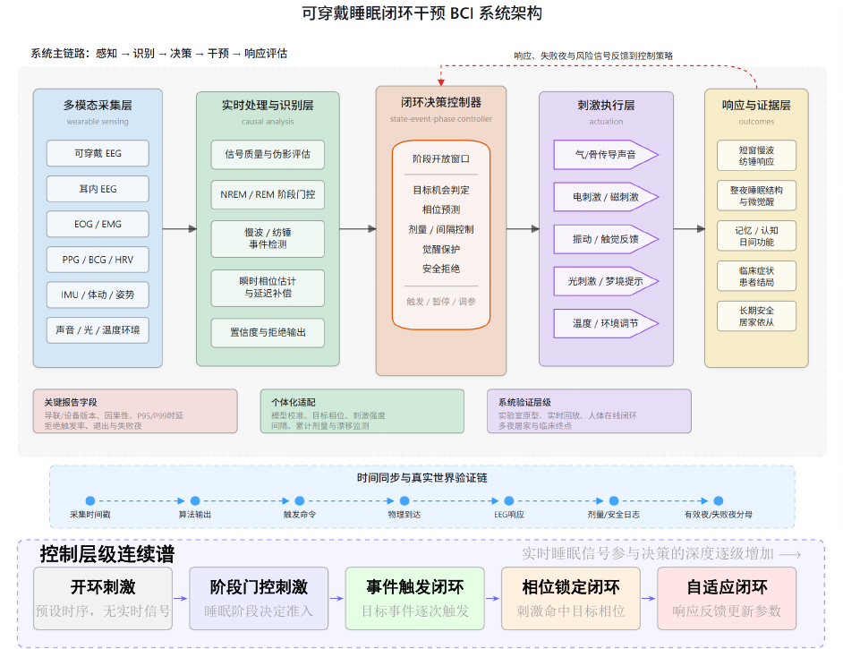
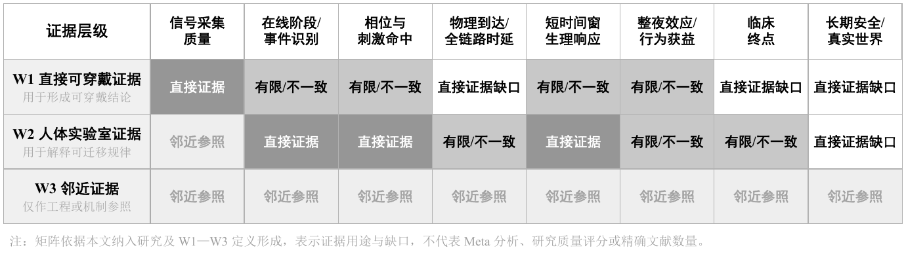

# 从睡眠监测到闭环干预：可穿戴EEG-BCI的算法路径与临床验证（v16完整稿）

作者：潘家辉¹*，郑滋乐²，林奕菲²  
单位：华南师范大学人工智能学院，佛山 528225

本稿是三级证据框架调整后的完整版本，对应 `wiki/review/格式/闭环睡眠干预综述-v16.tex`。v15保留为调整前版本，后续修改以本稿与v16 TeX为一组维护。

## 中文摘要

可穿戴传感与智能算法推动睡眠研究由离线监测转向实时闭环干预。本文围绕“感知—识别与决策—刺激—反馈—验证”链路，综述可穿戴脑电采集、在线分期、事件检测、相位估计、系统时延及多模态刺激进展，并将证据分为直接可穿戴证据、可迁移的人体睡眠闭环证据和邻近工程或机制证据。现有研究支持居家信号采集、阶段或事件门控和相位锁定刺激的技术可行性，但离线识别、刺激命中、生理调制、行为改善与临床获益仍缺乏连续验证。跨设备泛化、端到端时延、个体化适配、长期安全及失败夜报告是主要瓶颈。未来应加强因果评测、刺激物理到达标定和标准化真实世界验证，推动可穿戴EEG-BCI由监测工具向可靠闭环干预系统转化。

**关键词：** 闭环睡眠干预；可穿戴脑电；睡眠分期；相位估计；听觉刺激；实时系统

## English Abstract

Wearable sensing and intelligent algorithms are moving sleep research from offline monitoring toward real-time closed-loop intervention. Following a sensing–recognition and decision–stimulation–feedback–validation pathway, this review examines wearable EEG acquisition, online sleep staging, event detection, phase estimation, system latency, and multimodal stimulation. Evidence is stratified into direct wearable evidence, transferable human sleep closed-loop evidence, and adjacent engineering or mechanistic evidence. Current studies support the technical feasibility of home signal acquisition, stage or event gating, and phase-locked stimulation. However, offline recognition, stimulus targeting, physiological modulation, behavioral improvement, and clinical benefit have not yet formed a continuous chain of validation. Major barriers include cross-device generalization, end-to-end latency, individualized adaptation, long-term safety, and inadequate reporting of failed nights. Future studies should strengthen causal evaluation, calibrate the physical arrival time of stimulation, and standardize real-world validation to advance wearable EEG-BCI from monitoring tools toward reliable closed-loop intervention systems.

**Keywords:** closed-loop sleep intervention; wearable EEG; sleep staging; phase estimation; auditory stimulation; real-time system

## 1 引言

### 1.1 睡眠障碍的疾病负担与睡眠干预的临床需求

睡眠障碍是具有公共健康意义的系统性社会健康挑战。欧洲 47 国整合分析显示，成人阻塞性睡眠呼吸暂停（obstructive sleep apnea，OSA）、失眠、不宁腿综合征（restless legs syndrome，RLS）、发作性睡病和快速眼动（rapid eye movement，REM）睡眠行为障碍患病率分别为 18%、10%、3%、0.03% 和 0.009%（[[source-pages/bassetti-2026-sleep-disorders-europe-burden]]，PDF 第 1–2 页）。失眠的诊断级负担随判定口径而变化：面对面《精神障碍诊断与统计手册》（Diagnostic and Statistical Manual of Mental Disorders，DSM）访谈下合并患病率为 12.4%，成人临床相关慢性失眠全球估计为 16.2%、约 8.52 亿人（[[source-pages/van-straten-2025-insomnia-prevalence-meta]]，PDF 第 1 页；[[source-pages/benjafield-2025-global-insomnia-burden]]，PDF 第 2、6 页）。中国 OSA 按呼吸暂停低通气指数（apnea-hypopnea index，AHI）≥5 的汇总患病率为 11.8%，全球 20–79 岁成人 RLS 模型化患病率为 7.12%（[[source-pages/niu-2025-china-osa-prevalence]]，PDF 第 1 页；[[source-pages/song-2024-global-rls-prevalence]]，PDF 第 1 页）。这些结果共同说明，睡眠干预需求受疾病类别、地区范围和诊断口径共同塑造，不能被合并为单一负担数值。即便存在上述统计上的异质性，不同类型睡眠障碍的庞大患病人群仍构成了巨大的未被满足的干预需求，推动了可穿戴人工智能睡眠技术的发展。

在可穿戴睡眠技术领域，现有研究已在睡眠监测与评估方面形成较为丰富的证据基础，但闭环干预的长期与临床验证仍相对不足；可穿戴睡眠技术在监测与干预两个方向呈现出不同的证据成熟度：一项系统综述纳入60篇论文和34种可穿戴EEG设备，显示监测与睡眠评估已形成一定研究基础；闭环听觉刺激综述则指出，现有干预证据仍多集中于短期效应，长期睡眠、情绪和行为影响尚缺少充分验证（[[source-pages/de-gans-2024-eeg-wearables-systematic-review]]，PDF第1、9–10页；[[source-pages/esfahani-2023-closed-loop-auditory-principles]]，PDF第12–13页）。在成人慢性失眠的规范治疗方面，欧洲指南将失眠认知行为治疗（cognitive behavioral therapy for insomnia，CBT-I）列为一线治疗，美国睡眠医学会（American Academy of Sleep Medicine，AASM）指南也强推荐多组分 CBT-I（[[source-pages/riemann-2017-european-insomnia-guideline]]，PDF 第 1 页；[[source-pages/edinger-2021-aasm-behavioral-insomnia]]，PDF 第 1 页）。尽管 CBT-I 已被指南确立为循证治疗，其现实应用仍受到服务可及性有限以及部分患者退出或依从性不足的制约（[[source-pages/edinger-2021-aasm-behavioral-insomnia]]，PDF 第 1 页；[[source-pages/koffel-2018-cbti-access-utilization]]，PDF 第 1–2 页；[[source-pages/matthews-2013-cbti-adherence-systematic-review]]，PDF 第 1、10 页）。上述 CBT‑I 实施困境与可穿戴领域存在的技术转化缺口，促使学界对闭环睡眠干预寄予期待，但需求缺口的存在并不等同于闭环干预已经具备确切临床疗效：慢性失眠闭环听觉刺激试点虽观察到慢振荡即时增强，却未改善记忆巩固、宏观睡眠结构、觉醒次数或主观睡眠质量（[[source-pages/dudysova-2024-closed-loop-insomnia-pilot]]，PDF 第 1 页）。这一结果表明，实现特定神经生理靶点的实时调控，并不意味着其能够稳定转化为具有临床意义的睡眠改善或日间获益。因此，整合连续感知、状态识别、即时干预与反馈调整的闭环系统，更适合被视为改善监测与治疗衔接的重要候选技术路径之一；其临床价值仍有赖于刺激算法个体化、长期疗效及患者重要结局的进一步验证。

### 1.2 从睡眠监测到睡眠调控：闭环范式的提出

从“睡眠监测”向“睡眠调控”的过渡，核心在于将连续状态感知实时转化为干预决策。为统一不同研究的控制属性，本文依据实时睡眠信号参与决策的深度，将睡眠刺激范式划分为五个递进层级：开环刺激按照预设时间或序列运行，不使用实时睡眠信号；阶段门控刺激利用实时睡眠阶段决定是否开放刺激，但阶段内的刺激时序仍为预设；事件触发闭环根据实时检测到的慢波、纺锤波等目标事件逐次触发刺激；相位锁定闭环进一步估计或预测振荡相位，使刺激落入预设相位窗口；自适应闭环则在刺激后继续评价生理响应，并动态更新后续刺激的相位、强度、间隔或累计剂量（[[source-pages/esfahani-2023-closed-loop-auditory-principles]]，PDF 第 3、12 页；[[source-pages/weigenand-2016-open-loop-timing]]，PDF 第 1–3 页，Figure 1）。该连续谱描述的是控制逻辑，不代表不同层级已经获得相同程度的生理或临床验证。

这一范式转变相应拓展了睡眠脑机接口的算法任务边界。算法所面向的控制对象既包括睡眠阶段，也包括慢振荡、睡眠纺锤波等瞬态事件及更精细的振荡相位信息。因此，相关算法的功能需从离线睡眠分期扩展至在线状态识别、瞬态事件检测、相位预测、刺激时机决策及闭环反馈控制。Wireless Dreem Device（WDD）将非快速眼动睡眠第3期（N3期）门控、慢振荡相位估计和声音刺激递送串联起来，并在与多导睡眠监测（polysomnography，PSG）同步记录的健康青年样本中，实现了灵敏度为 0.70、特异度为 0.90 的实时 N3 检测；同时，该系统能够将声音刺激定位于慢振荡上升相附近，按该研究的相位零点与计算定义，报告的刺激相位为 45 ± 52°（[[source-pages/debellemaniere-2018-ambulatory-dry-eeg-closed-loop]]，PDF 第 1、6–7 页）。这一结果初步表明，可穿戴脑电图（electroencephalography，EEG）设备具备在居家环境中实施状态依赖性睡眠刺激的技术可行性。

由此，闭环系统的评价标准也由离线识别性能转向端到端调控性能。Ferster 等将非快速眼动睡眠（non-rapid eye movement，NREM）、慢波活动（slow-wave activity，SWA）、beta 功率和目标相位纳入联合门控；Portiloop 则进一步将采集、滤波、推理、决策和刺激执行的累计时延以及误触发、漏触发纳入工程评价（[[source-pages/ferster-2022-real-time-phase-algorithms]]，PDF 第 2 页；[[source-pages/valenchon-2022-portiloop]]，PDF 第 4、6、8–9 页）。因此，离线准确率不能单独代表闭环性能，还需综合考察端到端时延、触发可靠性、目标相位门控和扰动保护等实时约束。现有研究在目标事件、设备平台、研究人群和时延口径方面仍存在明显异质性，尚不足以进行直接的系统间比较。可穿戴 EEG 为长期居家闭环调控提供了技术条件，但系统可执行性和靶点调控能力并不等同于临床疗效，这也构成后续分析闭环系统架构及其临床验证路径的基本前提。

### 1.3 闭环睡眠干预系统的基本架构

闭环睡眠干预的基本架构可理解为由感知、识别/决策、刺激执行、反馈与失败保护共同组成的在线系统；在闭环听觉刺激（closed-loop auditory stimulation，CLAS）框架中，其最小实现包括实时脑活动访问、目标振荡检测和刺激系统（[[source-pages/esfahani-2023-closed-loop-auditory-principles]]，PDF 第 3 页）。沿用1.2节的连续谱，阶段信息仅决定刺激准入时属于阶段门控刺激；目标事件逐次决定是否刺激时属于事件触发闭环；在此基础上预测目标振荡相位时属于相位锁定闭环；只有刺激后的响应继续进入控制器并更新后续参数时，才属于自适应闭环。就现有睡眠研究证据而言，多数系统主要支持阶段门控、事件触发或相位锁定运行；“刺激—反馈—参数更新”的自适应闭环仍需在睡眠场景中得到完整实现和充分验证。

在感知层，系统首先要保证输入信号可用，例如 ENMod 以 5 秒均方根（root mean square，RMS）选择额区干 EEG 通道，但其居家研究中约 30% 数据集仍无可用 EEG，提示电极接触与质量控制会直接限制后续识别和干预环节（[[source-pages/bressler-2023-wearable-eeg-closed-loop]]，PDF 第 4–5、13–14 页）。在识别/决策层，系统需要将睡眠阶段、慢波活动（slow-wave activity，SWA）、高频活动、目标相位和运动/觉醒等风险信号转化为触发、拒绝或暂停规则（[[source-pages/ferster-2022-real-time-phase-algorithms]]，PDF 第 2 页；[[source-pages/debellemaniere-2018-ambulatory-dry-eeg-closed-loop]]，PDF 第 2、4–5 页）。刺激执行层则把决策输出转化为声音、电/磁或其他物理刺激，并记录采集、滤波、推理、决策、通信和输出等环节的时间戳，以及误触发、漏触发和执行失败等机会级结局（[[source-pages/valenchon-2022-portiloop]]，PDF 第 4、6、8–9 页）。反馈与失败保护层用于汇总刺激后的生理或行为响应、信号质量下降、觉醒风险和剂量暴露，并为后续参数调整或研究内安全暂停提供依据；但就现有睡眠研究证据而言，“刺激—反馈—参数更新”的自适应控制链条仍需在睡眠场景中得到更完整的实现和验证（[[source-pages/bergmann-2018-brain-state-dependent-stimulation]]，PDF 第 1–2 页；[[source-pages/zrenner-2024-closed-loop-brain-stimulation]]，网页摘要、正文第 2 节）。

如图 1-1 所示，可穿戴睡眠闭环干预系统可概括为“多模态采集—实时处理与识别—闭环决策控制—刺激执行—响应与证据评估”的主链路，并通过失败夜、风险信号、剂量日志和时间同步记录回流至控制策略与验证体系。该结构有助于区分后文讨论的输入信号质量、在线识别性能、端到端时延、刺激执行路径和临床验证层级。本文将其中直接利用脑信号进行状态、事件或相位判定并控制外部刺激的系统视为广义睡眠脑机接口，但对不使用脑信号的生理反馈系统仍采用“闭环睡眠干预系统”这一上位概念。

**图 1-1 可穿戴睡眠闭环干预系统架构与控制层级连续谱**

**Figure 1-1 Architecture and Control-Level Continuum of Wearable Closed-Loop Sleep Intervention Systems**

该图概括感知、识别、决策、干预、响应评估、时间同步和居家验证之间的系统关系，并以“开环刺激—阶段门控刺激—事件触发闭环—相位锁定闭环—自适应闭环”的连续谱标示实时睡眠信号参与决策的深度。

### 1.4 本文综述范围与结构安排

基于上述临床需求、范式边界与系统架构，本文将闭环睡眠干预界定为一种以睡眠相关状态或事件的实时感知为前提，并将识别结果用于干预触发、参数调节或效果评估的技术体系。后文将首先讨论可穿戴传感、实时信号处理、睡眠分期、事件/相位估计以及端到端时延等关键技术环节；随后围绕慢波睡眠和全睡眠周期两类应用场景，梳理听觉刺激、电/磁刺激及多模态刺激系统的实现方式、神经生理效应、行为或功能终点与验证层级；最后总结该领域在从生理增强走向临床获益、个体化参数设定、长期安全性以及居家真实世界评测等方面面临的挑战。本文不纳入缺乏实时触发逻辑、未设置睡眠相关终点，或仅有产品宣称而缺少可核验证据支持的研究。

根据研究与可穿戴睡眠闭环链路的直接关联程度，本文将证据分为三个层级：第一层为直接可穿戴证据，即使用头带、耳内、贴附式或移动端设备，在人体睡眠中完成信号采集、在线识别或刺激控制；其中仅完成监测的研究只支撑输入和居家可用性。第二层为可迁移睡眠闭环证据，即在实验室PSG、高密度脑电或台式系统中验证睡眠阶段、事件、相位算法及刺激效应，但尚未形成完整可穿戴链路。第三层为邻近工程、机制与背景证据，包括动物研究、侵入式系统、非睡眠同步平台、开放环干预以及流行病学和指南，仅用于解释机制、工程实现、风险或研究背景。后两类证据不得用于替代直接可穿戴系统的居家可用性、长期安全性或临床疗效证据；该关联层级也不等同于研究质量或偏倚风险等级。
基于上述范围，本文重点围绕以下五个相互衔接的研究问题展开：第一，以可穿戴及低通道脑电为主的睡眠信号，能否为在线睡眠阶段判别、瞬态事件检测和振荡相位估计提供可靠输入；第二，闭环系统能否在因果计算和端到端时延约束下，稳定命中目标脑状态并诱发可重复的神经生理调制；第三，刺激引起的瞬时或局部生理响应，能否进一步转化为整夜睡眠改善、行为获益或临床疗效；第四，在研究人群、设备平台和验证协议存在异质性的条件下，不同闭环系统应依据哪些共同维度开展分层评价，包括刺激命中、全链路时延、失败夜、安全停止和居家验证；第五，现有证据在个体化适配、长期安全、疾病人群验证和真实世界应用方面还存在哪些关键缺口，以及这些缺口为何会限制临床转化。上述问题依次对应闭环睡眠干预从信号输入、在线决策和刺激执行，到生理效应、功能结局及临床转化的完整证据链，并构成后续各章的分析主线。

为回答上述问题，本文的主要贡献体现在综述内容的组织与评价框架方面。首先，本文以“感知—识别与决策—刺激—反馈—验证”为主线，将可穿戴信号采集、实时算法、刺激执行和效果评价纳入同一闭环技术链条，避免将设备、算法与干预效果相互割裂。其次，本文区分离线算法性能、在线系统运行、刺激命中、神经生理响应、行为获益和临床疗效等证据层级，避免以局部技术指标替代完整闭环效果。再次，本文将采集、缓冲、预处理、推理、决策、通信、刺激执行及物理到达组织为完整时延链，并引入刺激机会级结局，用于分析机会漏失、安全拒绝、误触发、执行失败和相位偏移。最后，系统比较同时纳入失败夜、退出分母、安全停止和居家验证，并区分人体睡眠闭环直接证据与动物研究、预印本及非睡眠工程技术等补充证据。上述内容属于本文提出的分析与组织框架，旨在提高不同研究证据的可解释性，而不将其预设为该领域已经形成的统一评价标准。

### 1.5 文献检索与筛选方法

本文采用结构化叙述性综述方法，围绕闭环睡眠干预“感知—识别与决策—刺激—反馈—验证”全链路开展文献检索。2026年8月13—15日检索PubMed、OpenAlex、Scopus、Semantic Scholar和ClinicalTrials.gov，并通过引文追溯和定向补充完善检索体系；中国知网、万方、SinoMed及维普用于中文专项补充，但尚未形成与外文检索相同的完整命中和排除流程记录。检索词围绕可穿戴脑电、睡眠分期、闭环刺激、慢波振荡、实时相位估计、系统时延和居家睡眠干预等关键词组合设置。

本研究设置六条检索主线，覆盖闭环架构与时延、慢波锁相刺激、全睡眠周期干预、刺激模态与系统形态、个体化干预与安全性、可穿戴脑电与PSG验证六大研究维度。经线内去重得到文献786条，全局去重后保留647篇，另检出注册临床试验223项。因单篇文献可适配多条检索主题线，各主题检索数量不做累加统计。本文最终引用文献109篇，涵盖指南、综述、算法设备研究、人体干预试验、会议论文、预印本、动物实验及相关工程文献，该统计口径不同于系统综述的最终纳入文献数量。

文献纳入标准为可支撑睡眠信号检测、在线识别、相位估计、刺激触发、系统时延、生理响应、临床与行为结局、安全性及居家落地等任一核心研究环节。排除无睡眠相关终点、仅含离线数据且无法支撑闭环链路、产品宣传及方法信息无法核验的文献。同时明确各类文献的使用边界：预印本用于补充前沿探索成果，会议论文支撑算法与工程实现分析，动物实验仅阐释作用机制与潜在风险，相关工程文献仅作技术参照，上述文献均不直接用于推导人体临床疗效。

文献经跨平台去重和题录摘要初筛；对进入正文的关键证据核验可获得的全文或正式来源页面，并提取人群、设备信号、运行模式、刺激参数、时延、研究终点、安全性及试验质控信息。本研究分层区分信号质量、在线识别、刺激命中、生理效应、临床获益与长期安全，避免以离线性能替代在线表现或以瞬时脑电响应替代临床疗效。因未开展双人独立筛选、标准化偏倚风险评价及完整PRISMA筛选流程，本文定位为结构化叙述性综述，非系统综述或荟萃分析。

## 2 闭环睡眠干预的技术基础

### 2.1 可穿戴传感与实时信号处理

本节进一步讨论可穿戴 EEG 如何在低通道、干电极和家庭环境约束下形成可供在线识别使用的输入。本节证据所支持的范围主要是在线算法的数据准入与质量控制；具体状态、事件和相位输出的性能将在 2.2 节进一步讨论，检测与刺激执行形成的端到端时延则归入 2.3 节。

#### 2.1.1 单/双通道 EEG 与 PSG 的差异

多导睡眠监测（PSG）是临床睡眠分期和多类睡眠障碍客观评估的标准参考方法。PSG利用多通道脑电信号表征不同导联下的脑电活动，并结合眼电（EOG）与颏肌肌电（EMG）辅助判定N1期、REM期、觉醒及肌张力变化，还可通过呼吸和血氧等指标识别睡眠呼吸事件。相比PSG的多源信号体系，单/双通道低通道脑电仅保留局部脑电信息；部分研究已将其用于睡眠分期以及慢波、纺锤波检测，但其表现取决于导联位置、参考方式、受试人群、信号质量和具体任务，不能直接视为与临床PSG等效。其主要信息限制包括缺乏多导联空间信息、N1与REM等阶段更易混淆，并且单靠脑电不能直接识别呼吸事件或周期性肢体运动等临床指标（[[source-pages/mohamed-2023-wearable-eeg-review]]，PDF 第 1–3 页；[[source-pages/de-gans-2024-eeg-wearables-systematic-review]]，PDF 第 1、9–10 页）。

当前主流可穿戴脑电设备主要包括头带式、耳内式、柔性贴附式三类，设备性能对比需要统一考量电极数量与位置、电极材料、接触形式、参考导联方式以及与 PSG 的同步验证方案等关键参数，才能保证评价结果客观可信（[[source-pages/mohamed-2023-wearable-eeg-review]]，PDF 第 4–5 页）。但现有研究尚未形成统一规范，存在明显的研究异质性。一项涵盖 60 篇研究、34 种可穿戴脑电设备的系统综述指出，目前各类研究的设备配置、评价指标、验证场景差异较大，难以开展横向对比（[[source-pages/de-gans-2024-eeg-wearables-systematic-review]]，PDF 第 1、9–10 页）。

其中，电极布局与参考导联设置是影响低通道脑电检测性能的重要因素。Tabar 等人基于 20 名健康受试者的 80 次整夜 PSG 同步记录，对比了单耳、单耳联合同侧乳突、双耳交叉三种耳内脑电配置的睡眠分期效果，结果显示五分类 Cohen’s κ 系数分别为 0.36、0.63、0.72；在该样本和实验配置下，双耳交叉参考获得了更高的睡眠分期一致性（[[source-pages/tabar-2021-ear-eeg-sleep-assessment]]，PDF 第 1、3–4、6–8 页，Figure 1，Figures 2–3，Table 2）。

综上，低通道可穿戴脑电不存在固定统一的性能标准，其适用场景、检测精度高度依赖设备类型、导联配置、受试人群与检测任务。后续研究需结合细分场景，同时报告分睡眠阶段的细化性能与整夜整体指标，分层区分其临床疾病诊断价值与闭环睡眠干预的信号可用性（[[source-pages/de-gans-2024-eeg-wearables-systematic-review]]，PDF 第 9–10 页；[[source-pages/tabar-2021-ear-eeg-sleep-assessment]]，PDF 第 6–11 页）。

#### 2.1.2 干电极与可穿戴 EEG 信号质量

干电极通常无需涂抹导电膏，部分干式耳内 EEG 系统还支持用户自行佩戴和多夜居家记录，为自然睡眠环境下的连续监测提供了硬件条件。然而，其信号质量仍容易受到电极接触状态、耳道湿度以及眼动、面部和头部运动引起的电极微移与运动伪影影响（[[source-pages/mohamed-2023-wearable-eeg-review]]，PDF第4–5页；[[source-pages/mikkelsen-2019-ear-eeg-whole-night-sleep]]，PDF第3–4、8页；[[source-pages/pazuelo-2024-in-ear-signal-quality]]，PDF第2–3、6–12页）。

Mikkelsen 等人针对健康受试者开展整夜耳内干电极脑电研究：20 名22～36岁受试者共完成80次记录，总时长657小时。结果显示，脑电可用片段占比在0.80～0.98之间波动，耳甲腔电极接触是否良好、耳道湿度，是决定数据能否使用的主要因素（[[source-pages/mikkelsen-2019-ear-eeg-whole-night-sleep]]，PDF第1、3–4、8页，Figure 3）。Pazuelo 等进一步发现，眨眼、面部动作、头部转动都会破坏耳内脑电与标准头皮脑电的对应关系。这提示两类验证各有作用：清醒状态下的伪影测试用来评估设备抗运动干扰能力；而与PSG同步的整夜睡眠记录，用来检验真实睡眠场景的数据可靠性（[[source-pages/pazuelo-2024-in-ear-signal-quality]]，PDF第2–3、6–12页，Table 1）。

因此，评估信号质量不能依靠单一指标，应当综合考察电极接触阻抗、脑电功率谱和标准信号的一致性、与湿电极或PSG的相关程度、有效数据占比、信号掉线或饱和情况、伪影占比及整夜记录成功率。除此之外，还需要同步报告佩戴舒适度与皮肤耐受情况，以此判断设备是否可以从单次实验室记录拓展到长期居家反复使用（[[source-pages/mikkelsen-2019-ear-eeg-whole-night-sleep]]，PDF第1、3–4、8页；[[source-pages/pazuelo-2024-in-ear-signal-quality]]，PDF第2–3、6–12页）。本节重点评价硬件、电极与真实佩戴条件下的输入可用性；算法如何在线识别、拒绝和处理低质量信号，将在 2.1.3 节讨论。

#### 2.1.3 伪影处理与实时预处理

在硬件和佩戴条件决定输入可用性的基础上，闭环睡眠干预还需将低质量信号的发现、拒绝和处理前置到完整在线链路。标准化的实时预处理流程主要包含因果滤波或去趋势、信号质量判别、重度伪影剔除、在线数据标准化、滑动窗口分段处理与模型输入生成等关键步骤。传统离线分析常用的双向零相位滤波、整夜全局标准化算法，需要依托完整时序数据或未来信号样本，无法直接适配实时干预场景。为此，在线闭环系统必须明确界定因果滤波规则、滑动窗口的长度与步长、数据缓冲策略、运算硬件平台以及单窗口运算耗时等核心参数，以保障系统低延迟、稳定运行（[[source-pages/bressler-2023-wearable-eeg-closed-loop]]，PDF 第 4–6 页；[[source-pages/debellemaniere-2018-ambulatory-dry-eeg-closed-loop]]，PDF 第 2–5 页）。

现有可穿戴闭环系统的居家应用仍面临显著的信号质量问题。以 ENMod 为例，其在线链路通过 5 秒均方根（RMS）窗口筛选额区干 EEG 的有效信号通道；即便采用上述质控策略，其居家研究中仍有约 30% 的数据集没有可用 EEG，说明在线质控规则只能识别和隔离部分低质量输入，不能消除电极接触不稳定与干电极材料性能衰减等硬件来源的失败风险（[[source-pages/bressler-2023-wearable-eeg-closed-loop]]，PDF 第 4–5、13–14 页）。Debellemaniere 等人的研究进一步将干电极脑电信号接入实时 N3 睡眠识别与相位检测链路，并通过 PSG 同步对照及无人值守场景评价系统输入端的有效性（[[source-pages/debellemaniere-2018-ambulatory-dry-eeg-closed-loop]]，PDF 第 1–5 页）。

上述研究表明，闭环系统可将“低质量信号拒绝触发”作为降低错误干预风险的安全处置机制，即识别到低质量脑电片段时主动放弃刺激输出；但该机制也会造成部分刺激时机错失，产生刺激机会损失。因此，可穿戴闭环系统的输入层需要协同权衡数据保留率、系统运算时延与误触发风险（[[source-pages/bressler-2023-wearable-eeg-closed-loop]]，PDF 第 4–6、13–14 页；[[source-pages/debellemaniere-2018-ambulatory-dry-eeg-closed-loop]]，PDF 第 2–5 页）。

#### 2.1.4 辅助模态

针对低通道脑电固有的信息缺失，可通过多模态辅助信号补充睡眠监测所需的关键信息。不同模态具有不同的功能适配性：眼电（EOG）可辅助识别快速眼动睡眠，肌电（EMG）能够反映肌张力变化与觉醒状态，光电容积描记（photoplethysmography，PPG）可表征脉搏及自主神经活动变化，加速度计（accelerometer，ACC）则用于捕捉人体体动与睡姿改变（[[source-pages/mohamed-2023-wearable-eeg-review]]，PDF 第 1–3 页；[[source-pages/melo-2024-single-channel-eeg-actigraphy]]，PDF 第 1–3 页）。

多模态融合的居家睡眠监测已具备初步可行性。Shustak 等人研发的柔性临时纹身电极阵列可同步采集 EEG、EOG 和 EMG，并在医院与居家场景下获得稳定记录；其 6 小时睡眠记录呈现出可区分的睡眠阶段，但该研究仅验证了多模态居家监测的可行性，尚未应用于闭环干预场景（[[source-pages/shustak-2019-temporary-tattoo-sleep-monitoring]]，PDF 第 2–7 页）。需要注意的是，多模态辅助信号的增益具有任务依赖性，并非对所有睡眠识别任务均有显著提升。Melo 等人针对 23 名健康受试者开展 PSG 同步对照实验，对比单通道脑电头带单独使用及联合腕部体动记录的识别效果。结果显示，加入体动信号后，两种设备组合的 N1 期错误率分别由 15.7% 降至 9.8%、由 27.7% 降至 17.0%，但研究者认为体动信息对整体模型的贡献较小（[[source-pages/melo-2024-single-channel-eeg-actigraphy]]，PDF 第 1、5–6 页，Table 3，Figure 1）。

因此，多模态融合方案的性能评价需兼顾收益与成本，既要量化其对难区分睡眠阶段识别、伪影剔除和觉醒保护的边际增益，也要综合评估信号同步误差、设备功耗、佩戴负担以及单一模态信号缺失带来的性能损耗。对于闭环睡眠干预系统而言，多模态融合的重要价值并非仅优化常规睡眠分期精度，而是提高高风险信号状态下的触发容错能力，在局部脑电信号质量下降时利用多维信息维持更稳定、安全的脑状态判断，降低误干预风险（[[source-pages/shustak-2019-temporary-tattoo-sleep-monitoring]]，PDF 第 2–7 页；[[source-pages/melo-2024-single-channel-eeg-actigraphy]]，PDF 第 5–7 页）。

### 2.2 实时睡眠分期与瞬时相位估计技术

#### 2.2.1 阶段、事件与相位任务边界

闭环睡眠干预的识别与决策体系可划分为阶段、事件和相位三个递进的时间尺度，形成由粗至精的识别与决策链条。其中，阶段级判别用于界定干预候选窗口，决定系统是否满足刺激准入条件；事件级检测用于定位慢波、睡眠纺锤波等目标脑电波形；相位级估计则在单个振荡周期内确定目标刺激时点，实现更精细的定时干预。与之对应，三个层级具有各自的评价体系：阶段分期以基于 PSG 的人工评分结果为参照，事件检测重点考察事件匹配规则与假阳性控制能力，相位估计则需结合离线参考相位、圆周统计和刺激到达时延开展综合评估（[[source-pages/esfahani-2023-closed-loop-auditory-principles]]，PDF 第 2–4 页；[[source-pages/warby-2014-spindle-benchmark]]，全文 RESULTS 与 METHODS；[[source-pages/ferster-2022-real-time-phase-algorithms]]，PDF 第 1–2、7 页）。

在图1-1所示系统架构中，实时识别依次承担阶段门控、事件定位和相位定时等任务。本节据此区分阶段、事件与相位三个时间尺度，并分别讨论其评价指标和在线运行约束。

睡眠分期的 PSG 人工评分参考标签并非绝对客观的物理测量结果，而是由评分规则、信号导联方案和人工判读共同形成的规范化参考。不同评分体系及其版本之间存在差异，例如传统 R&K 标准与现行 AASM 标准在睡眠阶段划分和慢波睡眠判定规则等方面并不完全一致。即使统一采用 AASM 标准，人工评分结果仍可能存在评分者间和实验室间差异，其中 N1 等过渡性阶段因边界相对模糊，更容易出现判读分歧。此外，评分规则还可能随 AASM 手册版本迭代而调整。因此，算法研究使用的睡眠分期标签具有评分规则、手册版本、导联配置和判读流程依赖性，不宜被视为跨研究完全统一且绝对客观的标签（[[source-pages/danker-hopfe-2009-rk-aasm-reliability]]，PDF 第 1–9 页；[[source-pages/danker-hopfe-2004-eight-labs-reliability]]，PDF 第 1–6 页；[[source-pages/berry-2015-aasm-v2-2-updates]]，PDF 第 1–2 页）。

#### 2.2.2 公开数据集、标签体系与验证协议

算法模型的评估结果具有较强的场景依赖性，数据集来源、标签体系与训练—验证划分方式共同决定模型性能的可解释范围和适用边界。常用的睡眠分期公开数据资源主要包括 Sleep-EDF、SHHS、MESA 和 ISRUC-Sleep，其中 MASS 同时包含睡眠阶段与微结构标注；睡眠微结构研究还常使用 CAP Sleep、DREAMS、MASS 和 MODA 等数据资源（[[source-pages/phan-mikkelsen-2022-automatic-sleep-staging]]，PDF 第 6–7、15–17 页；[[source-pages/nam-2024-insightsleepnet]]，PDF 第 4–6 页；[[source-pages/hu-2024-mtff-net]]，PDF 第 6–8 页；[[source-pages/kulkarni-2019-real-time-spindle-detection]]，HTML §2.1–2.3；[[source-pages/valenchon-2022-portiloop]]，PDF 第 1–4、13–15 页）。不同于常规睡眠监测任务，闭环刺激研究还依赖实时干预信息，现有研究尚缺少被广泛采用的统一公开基准数据集。此类基准的关键字段应包括真实可穿戴原始 EEG、精确刺激到达时间戳、设备各环节的分项延迟以及刺激后的脑电响应数据（[[source-pages/esfahani-2023-closed-loop-auditory-principles]]，PDF 第 2–4、12–13 页；[[source-pages/ferster-2022-real-time-phase-algorithms]]，PDF 第 1–2、7 页；[[source-pages/valenchon-2022-portiloop]]，PDF 第 4、8–9、13–15 页）。表 2-1 汇总公开睡眠数据资源、标签体系与在线因果评测适用性。

**表 2-1 公开睡眠数据资源、标签体系与在线因果评测适用性**

**Table 2-1 Public Sleep Data Resources, Labeling Systems, and Applicability to Online Causal Evaluation**

| 数据资源 | 证据用途 | 标签与协议特征 | 在线因果评测适用性 |
| --- | --- | --- | --- |
| Sleep-EDF | 单导五分类、subject-wise 与跨库测试 | R&K 及 N3/N4 映射；版本和清醒截取方案影响样本构成 | 适合时序回放和离线泛化分析 |
| SHHS | 大规模 PSG 和外部验证 | 应用筛选样本与全量队列分开 | 适合多中心 PSG 域外部验证 |
| MESA | 多民族、跨人群与多模态候选 | 直接应用证据以 PPG 为主，EEG 闭环需连接额外证据 | 适合跨人群与多模态候选分析 |
| ISRUC-Sleep | 临床多模态五分类候选 | 已核验应用集中于 ISRUC-S3 | 适合离线双向模型验证 |
| MASS、DREAMS、MODA | 纺锤事件检测、外部测试和专家共识 | 标注者、OR/AND 起点、片段长度和共识规则影响事件标签 | 适合事件检测回放 |
| CAP Sleep | 病理人群与微结构候选 | 已纳入应用为 24 人 PPG 子集 | 适合病理人群与微结构邻近回放 |

不同公开数据集的版本、标注规则和样本处理方式可能改变模型评测结果。以 Sleep-EDF 为例，20 人和 78 人版本具有不同的样本构成，R&K 标签向 AASM 五分类的映射规则、清醒期片段截取方式以及 epoch-wise 与 subject-wise 划分策略，也会影响最终指标。SHHS 具有大样本、多中心 PSG 数据，更适合评价模型在多中心标准 PSG 数据上的表现。SleepTransformer 分别在 Sleep-EDF-78 和 SHHS 上报告结果，说明同一模型在不同数据条件下可能呈现不同性能。因此，跨研究比较必须同时说明数据集版本、标签体系、样本处理方式和验证划分方案（[[source-pages/phan-2022-sleeptransformer]]，PDF 第 2、5–8 页；[[source-pages/liu-2023-micro-sleepnet]]，PDF 第 3–8 页）。

验证协议差异是研究异质性的另一重要来源，不同验证方式对应不同层级的模型泛化能力。随机 epoch 划分主要评价片段级识别性能，但同一受试者的数据可能同时进入训练集和测试集，因而不能充分反映新受试者上的泛化能力；subject-wise 划分和留一受试者交叉验证（LOSO）用于评价跨受试者泛化；跨数据集测试还进一步引入人群、设备、机构及采集协议变化；无监督域适应（UDA）则评价目标域未标注数据可参与训练条件下的跨域适配能力。上述方案构成从片段识别、跨受试者泛化到跨数据域适配的验证梯度，但均不能单独替代真实居家闭环环境中的在线验证。Bresch、Mikkelsen 和 Gao 等分别采用受试者级交叉验证、LOSO 及跨数据集 UDA 方案，反映出现有研究的验证协议尚不一致（[[source-pages/bresch-2018-real-time-rnn-staging]]，PDF 第 3、8–9 页；[[source-pages/mikkelsen-2019-around-ear-rf-staging]]，PDF 第 3–10 页；[[source-pages/gao-2023-domain-adversarial-staging]]，PDF 第 5–9 页；[[source-pages/van-der-donckt-2023-traditional-ml]]，PDF 第 1–8 页）。

#### 2.2.3 阶段级表征与上下文模型

阶段级模型在闭环系统中的主要作用不是完成事后整夜评分，而是及时、可靠地开放或关闭刺激窗口。因此，模型比较应优先考察是否仅使用当前及历史信号、首次判定时间与更新周期、端侧内存和功耗、跨设备泛化能力，以及低置信度输出能否被安全拒绝，而不能只依据离线准确率排序。手工频谱或时域特征结合随机森林等浅层分类器，具有计算复杂度较低和特征含义相对明确的优势；Mikkelsen等在耳周可穿戴脑电上采用随机森林并进行LOSO验证，可作为低通道设备的可解释基线。TinySleepNet等单通道端到端模型减少了人工特征设计，并为资源受限部署提供候选结构，但其离线数据集结果仍不能直接证明完整系统具备在线闭环能力（[[source-pages/mikkelsen-2019-around-ear-rf-staging]]，PDF第1、3–10页；[[source-pages/supratak-2020-tinysleepnet]]，PDF第1–4页）。

上下文建模能够利用睡眠阶段的时序演化规律提高分期性能，但信息访问方向决定模型能否用于因果推理。SeqSleepNet、SleepEEGNet及采用BiGRU、BiLSTM的模型通常利用前后向信息，SleepTransformer也通过完整序列建模长距离依赖；这些结果可作为离线性能参照，但不能直接用于实时刺激决策。面向闭环部署，模型应限制为当前及历史信息，并报告由因果化带来的性能变化、状态预热时间和输出更新频率。FlexSleepTransformer所体现的多通道配置适配和混合数据训练，可为跨设备输入适配提供方法参考，但尚不能替代真实可穿戴设备上的在线验证（[[source-pages/phan-2019-seqsleepnet]]，PDF第3–8页；[[source-pages/mousavi-2019-sleepeegnet]]，PDF第4–11页；[[source-pages/liu-2023-psg-bigru-attention]]，PDF第1、6–8页；[[source-pages/zhang-2023-single-channel-dcnn-bilstm]]，PDF第1、5–7页；[[source-pages/phan-2022-sleeptransformer]]，PDF第3–9页；[[source-pages/guo-2024-flexsleeptransformer]]，PDF第4–12页）。

状态空间模型（state space model，SSM）为长时序脑电的递推状态更新和有限缓存提供了潜在路径。MultiSEss已在离线睡眠五分类和消融实验中展示相关建模能力，但其闭环价值仍需通过因果配置、状态缓存、端侧内存、功耗和真实流式推理时延加以验证。无EEG双向Mamba模型仅作为多模态可穿戴分期的邻近技术证据；由于其不使用EEG且依赖双向信息，不能用于支持因果EEG分期、事件检测或相位控制。由此，阶段级模型进入闭环系统的关键不在于网络结构是否更新，而在于其是否同时满足因果信息访问、端侧运行、跨设备稳定性和安全拒绝要求（[[source-pages/huang-2025-multisess]]，PDF第4–12页；[[source-pages/zhang-2026-mamba-wearable-staging]]，PDF第1、5–9页）。

#### 2.2.4 事件检测与相位预测算法

相较于粗粒度的睡眠阶段分期，睡眠微结构事件检测以睡眠纺锤波、慢波等稀疏瞬态波形为识别对象，其性能评价需结合逐样本（sample-wise）与逐事件（event-wise）统计口径、事件重叠阈值和时间容差规则。事件标注标准与共识规则的差异会影响算法评测结果。Warby 等基于 110 名健康受试者的 N2 期脑电数据和 24 名专家标注建立群体共识，显示专家共识基准、OR/AND 组合规则和事件边界定义会改变算法评价结果（[[source-pages/warby-2014-spindle-benchmark]]，全文 RESULTS 与 METHODS）。SpindleNet 采用 250 ms 移动窗口输出纺锤波概率，不同专家共识起点会改变计算得到的检测延迟；Portiloop 则将 FIR 滤波、人工神经网络概率输出、阈值判断和声音控制器连接为端侧事件检测工程链。因此，闭环场景中的事件检测除 precision、recall 和 F1 外，还应报告每小时假阳性数量、事件起点、峰值和终点误差，以及波形形成等待产生的检测延迟（[[source-pages/kulkarni-2019-real-time-spindle-detection]]，HTML §2.1–2.3、§3.3；[[source-pages/valenchon-2022-portiloop]]，PDF 第 1–4、8–9、13–15 页）。

实时相位估计旨在未来信号未知的因果约束下估计当前脑电振荡相位，其主要技术问题包括因果滤波、相位预测和刺激延迟补偿。Ferster 等在同一慢波基准下比较幅度阈值、锁相环（phase-locked loop，PLL）和相位声码器三类方案；Santostasi 等通过探索性人体听觉刺激实验评价 PLL 的实时应用；Piorecky 等进一步比较固定延迟补偿与 PLL 方案。这些研究表明，相位算法评价需要同时说明离线参考相位、导联配置、受试人群、幅度门控规则、目标相位和圆周统计误差，以避免直接比较实验条件不同的结果（[[source-pages/ferster-2022-real-time-phase-algorithms]]，PDF 第 1–2、7 页；[[source-pages/santostasi-2015-pll-acoustic-stimulation]]，HTML Results 3.3–3.4；[[source-pages/piorecky-2021-real-time-slow-oscillation]]，PDF 第 6、12–20 页）。

为补偿信号处理、设备通信和刺激执行产生的延迟，预测型算法可通过相位外推提前确定刺激指令时点。Zrenner 等构建的实时 EEG 触发经颅磁刺激系统采用自回归模型进行相位预测，为相位外推提供了非睡眠场景的邻近方法证据。Bressler 等研发的可穿戴闭环系统采用逐样本端点校正希尔伯特变换（endpoint-corrected Hilbert transform，ecHT）追踪入睡前 alpha 相位，并依据预设的生理潜伏期调整声音起始相位。两项研究分别为预测型相位估计和可穿戴相位控制提供方法证据。完整评价还需在统一设备时钟下分别报告数据采集、滤波、相位预测、通信、刺激执行及刺激实际到达的时延（[[source-pages/zrenner-2020-real-time-eeg-tms-phase]]，PDF 第 1–7 页；[[source-pages/bressler-2023-wearable-eeg-closed-loop]]，PDF 第 3–5 页）。

#### 2.2.5 在线部署、输出可靠性与模型级评价

闭环系统的严格在线属性贯穿信号预处理、网络前向推理、结果后处理和系统运行全过程，离线算法与在线算法的关键差异在于因果约束和未来信息是否可用。现有部分睡眠分期研究呈现“结构因果、实验离线”的证据分层：Patanaik 等的在线版本以历史输出替代离线修正所使用的未来输出，但其声音演示仍采用时间正反向滤波，因此算法输出可在线返回并不意味着完整处理链满足严格因果性；Bresch 等明确采用单向 CNN-LSTM 因果架构适配流式输入，但其主要性能结果仍来自离线数据集测试。由此，因果网络结构、在线回放、端侧设备推理和真实人体闭环系统应被视为不同层级的技术证据，不能相互替代（[[source-pages/patanaik-2018-end-to-end-real-time-sleep-staging]]，PDF 第 3–5 页；[[source-pages/bresch-2018-real-time-rnn-staging]]，PDF 第 2–5、8–10 页）。

现有研究分别覆盖模型压缩、可穿戴采集、无线通信和移动端推理等部署环节。DistillSleep 针对单通道脑电开展模型蒸馏与端侧评价；Hsieh 等搭建眼罩采集、BLE 无线传输和移动端推理链路；Esparza-Iaizzo 等分别评价 OSA 与非 OSA 人群中的实时睡眠分期表现；国内双通道在线分期和无线可穿戴脑电研究则补充了低通道系统的工程实现证据（[[source-pages/park-2025-distillsleep]]，PDF 第 1–12 页；[[source-pages/hsieh-2021-eyemask-real-time-staging]]，PDF 第 2–9 页；[[source-pages/esparza-iaizzo-2026-real-time-scoring]]，PDF 第 1–10 页；[[source-pages/wu-2023-dual-channel-online-staging]]，PDF 第 1–10 页；[[source-pages/kang-2024-wireless-wearable-eeg-system]]，PDF 第 1–5 页）。Micro SleepNet 在 Android 端报告约 100 KB 的模型体积和约 2.8 ms 的单次输入推理时间，说明模型计算本身具有较低开销，但不足以单独证明模型输出可支撑实时闭环；模型级评价至少还需说明 30 s 输入窗口形成、采集、预处理和推理输出更新时间，后续通信、决策、刺激执行及刺激到达链路则需作为系统级问题另行评价（[[source-pages/liu-2023-micro-sleepnet]]，PDF 第 2、8–10 页）。

跨域泛化与个体化适配涉及训练阶段能否接触目标域、是否使用少量个体校准数据以及是否开展完全独立外部测试等不同设置。UDA 研究显示，在训练阶段能够接触未标注目标域数据的条件下，模型可以开展跨数据域适配，但该设置不能等同于完全独立的外部验证。可穿戴设备的实际部署还会引入跨导联、跨设备、跨夜和个体生理差异。现有研究已提供跨受试者、跨数据集和部分端侧实现证据，但跨设备稳定性与长期多夜个体化仍缺少充分验证（[[source-pages/bresch-2018-real-time-rnn-staging]]，PDF 第 3、8–9 页；[[source-pages/mikkelsen-2019-around-ear-rf-staging]]，PDF 第 3–10 页；[[source-pages/gao-2023-domain-adversarial-staging]]，PDF 第 5–9 页；[[source-pages/van-der-donckt-2023-traditional-ml]]，PDF 第 1–8 页）。

模型输出可靠性可从概率校准、不确定性估计、选择性拒绝和人工复核等相互关联但不可互相替代的维度评价。Hong 等将模型置信度最低的 20% epoch 交由人工复核后，总体准确率由约 76% 提高至 87%，展示了置信度排序和人机协作修正低置信输出的潜在价值；U-PASS 和 van Gorp 等则提供了不确定性量化及专家协作的评价框架（[[source-pages/hong-2021-confidence-based-scoring]]，PDF 第 1、7–9 页；[[source-pages/heremans-2024-upass]]，PDF 第 1–10 页；[[source-pages/van-gorp-2022-uncertainty-framework]]，PDF 第 1–6 页）。SwSleepNet 所称的“在线校准”主要指利用长序列上下文对短片段预测进行重判，不是以期望校准误差（expected calibration error，ECE）、Brier 分数或可靠性曲线评价的概率校准，两者属于不同层面的输出后处理（[[source-pages/zhu-2024-swsleepnet-online-calibration]]，PDF 第 1、3–9 页）。

面向闭环应用，识别评价可按四组指标组织：分期性能包括准确率、平衡准确率、macro-F1、逐期 precision、recall、F1、Cohen’s κ 和混淆矩阵；概率校准使用 Brier 分数、ECE 和可靠性曲线评价预测置信度与经验正确率的一致程度；选择性拒绝同时报告保留样本覆盖率、拒绝率、拒绝后的选择性风险及拒绝前后性能；泛化能力则通过 subject-wise、LOSO、跨数据集、跨中心和跨设备测试评价。本文进一步建议以受试者为基本统计单位报告置信区间和最差亚组结果，用以补充全部 epoch 池化统计。事件检测还需报告 event-wise 指标、每小时假阳性数量及事件时间误差，相位估计则需报告圆周误差、离散度和目标相位窗口命中率（[[source-pages/de-gans-2024-eeg-wearables-systematic-review]]，PDF 第 9–10 页；[[source-pages/warby-2014-spindle-benchmark]]，全文 RESULTS 与 METHODS；[[source-pages/ferster-2022-real-time-phase-algorithms]]，PDF 第 1–2、7 页；[[source-pages/hong-2021-confidence-based-scoring]]，PDF 第 1、7–9 页；[[source-pages/heremans-2024-upass]]，PDF 第 1–10 页；[[source-pages/van-gorp-2022-uncertainty-framework]]，PDF 第 1–6 页）。上述指标主要评价识别模型及其输出；涉及刺激执行、物理到达和机会级结局的系统评价将在 2.3 节讨论。

综上，本文将面向闭环的实时睡眠识别技术归纳为阶段门控、事件定位、相位定时、在线部署和跨域个体化适配五个相互衔接的层级，用于组织从状态筛选、瞬态波形定位、振荡周期内定时到端侧运行和场景泛化的相关证据。算法横向比较除统一数据集、标签、划分和运行模式外，还需统一输入通道、目标任务、受试人群和评价指标；跨研究结果差异则应结合标注规则、设备特性、人群构成和验证协议解释。后续研究可重点补充同一模型下 epoch-wise 与 subject-wise 划分的直接对照、跨设备概率可靠性与拒绝风险、整夜设备功耗、模型输出时间戳记录，以及不同评分手册版本对算法可比性的影响（[[source-pages/de-gans-2024-eeg-wearables-systematic-review]]，PDF 第 9–10 页；[[source-pages/danker-hopfe-2009-rk-aasm-reliability]]，PDF 第 1–9 页；[[source-pages/gao-2023-domain-adversarial-staging]]，PDF 第 5–9 页；[[source-pages/hong-2021-confidence-based-scoring]]，PDF 第 1、7–9 页；[[source-pages/ferster-2022-real-time-phase-algorithms]]，PDF 第 1–2、7 页）。正式证据池与逐项可比性见[[review/2.2正式证据池与统一算法比较表]]。
### 2.3 闭环时延链路、同步机制与机会级评价

在完成输入质量控制和在线识别评价后，闭环系统还需进一步回答刺激何时执行、是否实际到达以及每次干预机会是否成功。闭环睡眠干预系统的实时性可以拆解为具有明确起止点的时延链路。本文将系统总时延操作性地分解为窗口或生理事件形成、信号采集、数据缓冲、在线预处理、模型推理、干预决策、设备通信、刺激执行和刺激物理到达等环节；程序设定的补偿间隔以及听觉通路等生理潜伏期作为独立变量记录，不与工程执行时延混合（[[source-pages/esfahani-2023-closed-loop-auditory-principles]]，PDF 第 3 页；[[review/2.3形式化指标与系统比较表]]）。在这一分析框架下，现有研究报告的约 5 ms 局部计算时间、检测后 350 ms 等待参数和约 62 ms 生理潜伏期补偿分别对应算法执行、策略控制和特定系统采用的生理补偿参数，不能直接合并为同一种“系统时延”（[[source-pages/piorecky-2021-real-time-slow-oscillation]]，PDF 第 6、12–20 页；[[source-pages/bressler-2023-wearable-eeg-closed-loop]]，PDF 第 3–5 页）。

阶段级门控的时间结构由输入窗口、状态确认规则和在线更新节律共同决定。Patanaik 等的系统需要形成 30 s epoch，并按 1 s 节律更新输出；在线上下文和因果滤波群延迟还会影响首次可能触发的时刻。Bresch 等采用单向 CNN-LSTM 因果架构，但其主要性能证据来自离线数据集测试，二者的在线证据层级并不相同（[[source-pages/patanaik-2018-end-to-end-real-time-sleep-staging]]，PDF 第 3–7 页；[[source-pages/bresch-2018-real-time-rnn-staging]]，PDF 第 2–5、8–10 页）。为便于比较，阶段门控研究宜报告窗口长度、滑动步长、历史和未来信息访问范围、滤波群延迟及低置信度拒绝规则；如采用连续多个 epoch 确认状态，还应报告确认数量和更新逻辑，从而将状态确认时间与模型执行时间分开呈现。

事件级检测需要联合解释运算耗时、策略等待和标注口径。SpindleNet 的单次平均执行时间约为 6 ms；根据多位专家标注采用 OR 或 AND 共识组合后确定的不同事件起点，其相对人工参考的检测延迟约为 150–350 ms，说明真值定义会改变时延估计（[[source-pages/kulkarni-2019-real-time-spindle-detection]]，HTML §2.3、§3.3）。Portiloop 在 MODA 工程案例中将 40 ms FIR、20 ms ANN 和 4 ms 声音控制器组成 64 ms 常数链路，另估计约 250±100 ms 的可变检测等待，总计约 314 ms；阈值设为 0.84 时，按照刺激是否落入标注纺锤波的研究内定义，precision 和 recall 均为 0.71（[[source-pages/valenchon-2022-portiloop]]，PDF 第 13–15 页，Table 2、Figure 6）。这些结果适合用于分析单项研究内部的阈值、等待时间和事件命中精度权衡，不宜脱离真值定义进行跨系统比较。

相位级系统需要区分算法相位时间戳、刺激命令时间戳和刺激物理到达时间戳。CLAS-hdEEG 在 14 名健康参与者的 N3 期记录中报告 20.03±0.5 ms 的“检测至刺激”时延和 0.913 的 90°目标窗口命中率，其时间锁定依据为 EGI 记录的 DIN 硬件标记；该标记能够记录触发事件，但不能替代声音实际到达受试者的物理测量（[[source-pages/bazregarzadeh-2026-clas-hdeeg]]，摘要、Methods 2.1–2.4、Results 3）。Wong 等的儿童颅内闭环系统也通过临床 EEG 设备的触发接口进行时间锁定，用于检测—触发链路和神经响应分析（[[source-pages/wong-2026-intracranial-closed-loop]]，Figure 1、Results）。若需测量刺激实际到达时间，可进一步使用麦克风、人工耳或刺激器回读，将命令生成至物理到达的过程纳入同一时间轴。慢波振幅条件对相位算法表现的影响见 2.2 节（[[source-pages/ferster-2022-real-time-phase-algorithms]]，PDF 第 7 页）。

除整体精度外，本文建议进一步按单次刺激机会登记结局，包括合格机会、刺激成功送达、机会漏失、低置信度安全拒绝、无目标误触发、命令形成后的执行失败，以及刺激虽已送达但落在目标窗口外的时机失败；报告时应明确分母是生理事件、刺激、夜晚还是受试者，并在条件允许时同时给出多个层级（[[review/2.3形式化指标与系统比较表]]）。Debellemaniere 等的居家研究和 Wong 等的儿童颅内临床研究已分别报告刺激数量、静音保留触发、阶段分布或暂停规则等部分字段，可为机会级评价提供实例，但两者的设备和场景不能直接合并比较（[[source-pages/debellemaniere-2018-ambulatory-dry-eeg-closed-loop]]，PDF 第 4–8 页；[[source-pages/wong-2026-intracranial-closed-loop]]，Results）。刺激间隔和每夜刺激数还属于剂量变量；居家 PTAS 与 hdEEG 再分析提示，刺激间隔可能影响生理或行为响应，因此剂量、精度和时延宜在同一框架下联合解释（[[source-pages/kasties-2025-home-ptas-isi]]，Abstract、Results；[[source-pages/leach-2025-local-modulation-timing]]，摘要、Results）。

综上，本文将闭环系统的时延与精度归纳为时延链路、同步链路和机会级结局三类评价对象。在同一研究、同一时间零点和同一真值定义下，可以分析精度、时延和剂量之间的内部权衡；跨研究解释则应至少说明时延统计口径、主时钟、固定偏移、漂移和校正残差。在样本量允许时，本文建议除均值外进一步报告中位数、四分位距、P90、P95、P99、最大值和时序抖动，以识别、降低并解释设备及校准方案造成的系统偏差。LSL 与 Thalamus 提供多设备同步、时钟偏移测量和失效保护等邻近工程方法，可作为睡眠闭环刺激链路时序标准化的工程参照（[[source-pages/kothe-2025-lsl-sync]]，§1.2、§2.2、§3；[[source-pages/haggerty-2026-thalamus]]，PDF 第 8–16 页）。
## 3 慢波睡眠闭环干预

本章主要依据实验室人体闭环研究形成的 W2 证据，分析刺激相位、刺激序列以及生理—行为效应之间的关系；这些研究用于回答“闭环刺激在受控条件下能否命中目标脑状态并产生效应”，不直接证明可穿戴系统在居家环境中的有效性。WDD、耳内 EEG 和居家多夜系统等 W1 证据，则用于检验上述机制能否在低通道、易受伪影影响且存在设备时延的实际佩戴链路中复现。因而，本章按照“W2 建立机制与效应边界—W1 检验可穿戴迁移能力”的路径组织证据。

### 3.1 锁相听觉刺激的原理与范式演进

慢波锁相听觉刺激将第 2 章讨论的睡眠阶段门控、目标波形检测、相位估计和刺激执行连接为一条可检验的干预链路。开放环方案通常按照预设时刻或固定间隔递送声音，每次刺激的触发不依赖目标慢振荡的即时相位；部分方案虽可预先限定睡眠阶段，但仍不构成逐次相位响应式控制（[[source-pages/weigenand-2016-open-loop-timing]]，PDF 第 1–4 页；[[source-pages/esfahani-2023-closed-loop-auditory-principles]]，PDF 第 2–5 页）。相比之下，闭环锁相刺激首先根据 NREM 状态确定刺激候选窗口，再检测目标慢波并估计其相位，在预设时点发出刺激；当检测到觉醒、运动或睡眠阶段改变时，系统可依据既定保护规则暂停或拒绝触发（[[source-pages/debellemaniere-2018-ambulatory-dry-eeg-closed-loop]]，PDF 第 2、4–5 页；[[source-pages/ferster-2022-real-time-phase-algorithms]]，PDF 第 2 页）。因此，闭环锁相刺激的主要技术特征是提高刺激时机与目标神经生理状态的匹配程度，但其实际表现仍受到波形检测误差、刺激链路延迟以及个体慢波形态差异等因素限制（[[source-pages/esfahani-2023-closed-loop-auditory-principles]]，PDF 第 3、12–13 页；[[source-pages/ferster-2022-real-time-phase-algorithms]]，PDF 第 2、7 页）。

早期慢波听觉刺激范式常在慢振荡上升相附近递送成对短音，旨在利用第二声进一步增强随后出现的慢波响应。此后，刺激策略扩展为事件触发闭环。Ngo 等提出的 Driving 协议并非按照固定间隔连续递送后续声音，而是在再次检测到目标负半波时才发出下一次刺激。实验结果显示，增加刺激次数并未产生超过 2-Click 条件的效应，纺锤波响应还随重复刺激逐渐减弱。该结果提示，闭环刺激的价值不只在于增加刺激数量，还在于根据即时脑电状态确定后续刺激是否继续，并在系统设计中考虑响应衰减、不应期和停止条件；若后续刺激仅按预设序列递送，则可能在生理响应已经减弱时继续累积刺激剂量（[[source-pages/ngo-2015-self-limiting-auditory-closed-loop]]，PDF 第 1–3、6–8 页）。

相位调控策略由固定延迟方案逐步扩展至在线相位估计与预测。Santostasi 等采用锁相环算法开展实时慢波锁相刺激；按该研究的相位零点和计算定义，预设目标相位为 240°时，报告的平均刺激相位为 243.15±3.06°。由于不同研究的零相位、导联、滤波和刺激时间戳定义可能不同，该角度不能脱离原研究定义直接与其他系统比较。此外，该研究的生理验证样本仅 5 人，且未报告从信号采集到刺激物理到达的完整系统总时延，因此结果仍需在更大样本和完整时延链路下验证（[[source-pages/santostasi-2015-pll-acoustic-stimulation]]，HTML Results 3.3–3.4）。Ferster 等比较幅度阈值、锁相环和相位声码器三类算法，结果显示慢波振幅条件会改变不同算法的相位估计表现，低振幅慢波尤其会影响算法间的相对比较（[[source-pages/ferster-2022-real-time-phase-algorithms]]，PDF 第 7 页）。这些结果提示，固定算法参数难以直接跨设备和人群复用，相位控制需结合电极导联、慢波振幅分布、个体振荡频率及刺激链路的生理潜伏期进行校准（[[source-pages/esfahani-2023-closed-loop-auditory-principles]]，PDF 第 3–5 页；[[source-pages/bressler-2023-wearable-eeg-closed-loop]]，PDF 第 3–5 页）。

刺激范式的设计还涉及声音频谱、声压、包络形态、脉冲数量和刺激间隔等参数。Debellemanière 等在比较声音优化方案时采用十声刺激协议，其中仅第一声由闭环系统触发，后续声音按照预设时序播放。因此，该方案属于“事件触发启动—后续开放序列”的混合范式，不能归为每次刺激均由实时脑电事件决定的逐声事件触发闭环（[[source-pages/debellemaniere-2022-optimising-sounds]]，PDF 第 1、3–6 页）。跨年龄分析进一步显示，较强响应通常出现在慢振荡峰值附近，中老年人的有效刺激相位窗口相对更窄，提示其可能需要更严格的刺激时机控制（[[source-pages/navarrete-2019-optimal-timing-closed-loop]]，PDF 第 1、7–13 页）。总体而言，W2 实验室研究已用于识别相位窗口、响应衰减、不应期和停止时机等控制规律，但这些规律进入可穿戴系统后，还需通过 W1 研究重新验证低通道信号下的检测可靠性、刺激实际到达时延、失败夜比例和安全停止能力。现有 W1 证据主要支持阶段门控、事件触发和相位锁定链路的技术可行性；能够根据刺激后响应和跨夜历史数据自主更新相位与剂量的自适应闭环，仍缺少充分验证（[[source-pages/debellemaniere-2018-ambulatory-dry-eeg-closed-loop]]，PDF 第 4–9 页；[[source-pages/bressler-2023-wearable-eeg-closed-loop]]，PDF 第 4–6、11–14 页）。

### 3.2 慢波与纺锤活动调制及其耦合的生理证据

本节以下生理效应主要来自 W2 实验室人体研究，用于界定闭环刺激的生物学效应及其边界；除明确标注的居家或可穿戴研究外，不将其直接解释为 W1 系统的实际干预效果。分析慢波干预效应，首先需要区分刺激锁定的秒级瞬时响应、刺激时段内的局部变化和整段睡眠层面的持续性改变。Besedovsky 等针对 14 名健康男性开展交叉对照研究，结果显示，在 120 min 刺激时段内，0.8～1.1 Hz 频段功率相较假刺激条件增加（p=0.006，Cohen’s d=0.71），慢振荡（slow oscillation，SO）振幅也有所增加（p=0.047，d=0.42）；但刺激后时段未继续观察到相同变化，整夜睡眠结构也未出现明显差异（[[source-pages/besedovsky-2017-auditory-clas-immune]]，PDF 第 2–3 页，Figure 1、Table 1）。Henin 等同样观察到刺激锁定的瞬时慢波响应，但在午睡时段和整夜尺度上，SO 数量、振幅或斜率均未呈现稳定一致的刺激—对照条件差异（[[source-pages/henin-2019-clas-oscillations-not-memory]]，PDF 第 6–10 页，Tables 3、6、Figures 2–5）。因此，“能够诱发刺激锁定的慢波响应”与“提高整段睡眠的慢波负荷”属于不同层级的研究终点，短时间窗内的功率变化不能直接替代整夜 SWA、慢波事件数量或睡眠结构变化。

对纺锤波干预效应的分析同样需要区分事件层面和功率层面的不同指标。Papalambros 等针对健康老年人的研究显示，刺激条件下纺锤波密度由 5.5 次/min 增加至 5.8 次/min（p=0.001），纺锤波振幅由 12.9 μV 增加至 14.1 μV（p<0.001）；但同一研究中，整段 NREM 睡眠的 SWA 未见刺激与对照条件间差异（p=0.80），快纺锤波功率增加 2.2%，亦未达到统计学显著水平（p=0.14）（[[source-pages/papalambros-2017-acoustic-enhancement-older]]，PDF 第 5–8 页，Table 1、Figures 4–5）。Henin、Henao 和 Jourde 的研究分别在刺激后约 1 s 观察到快纺锤波、慢纺锤波或 sigma 频段的短时间窗响应（[[source-pages/henin-2019-clas-oscillations-not-memory]]，PDF 第 6–10 页；[[source-pages/henao-2022-in-ear-eeg-clas]]，PDF 第 6–8 页；[[source-pages/jourde-2025-spindle-clas]]，PDF 第 5–8 页）。然而，Jourde 的居家研究中，两种实验条件下的整夜纺锤波检测数量分别为 1050.8±677.1 和 939.0±492.5，差异未达到统计学显著水平（p=0.557，r=0.236）（[[source-pages/jourde-2025-spindle-clas]]，PDF 第 5–8 页，Figures 2–3）。因此，上述结果不能合并为单一的“纺锤增强率”；纺锤波密度、振幅、发生概率和 sigma 功率对应不同的评价终点，需要分别解释。

慢振荡—纺锤波关系呈现相位依赖性和状态依赖性。Navarrete 等研究发现，青年人在−54°至 133.2°的慢振荡相位窗口内接受刺激后，纺锤波出现概率为 20.8%（95% CI 15.9%～25.6%），而假刺激时间点为 8.2%（95% CI 6.7%～9.8%）；青年人的刺激后响应主要与刺激相位相关，中老年人的响应则更多受到距上一次纺锤波事件时间间隔的影响（[[source-pages/navarrete-2019-optimal-timing-closed-loop]]，PDF 第 7–10 页，Figures 2、4）。针对同一青年数据集的正式版再分析进一步显示，刺激前的慢振荡和纺锤波状态能够预测刺激后的短时间窗响应；该结果支持刺激前脑电状态具有响应预测价值，但不能单独证明刺激产生了独立干预效应（[[source-pages/navarrete-2022-ongoing-oscillations-outcome-formal]]，PDF 第 1–6 页）。因此，现有证据提示刺激后响应受到慢振荡相位、既有纺锤波状态和事件间隔等条件影响；但相位—发生概率、慢振荡锁定纺锤波功率和峰值附近 sigma 幅度等指标的定义并不统一，不宜笼统视为可跨研究直接比较的“耦合强度”。

对照实验设计进一步限定了“脑电调制”的实际含义。Ngo 等设置三种实验条件进行比较：匹配个体快纺锤波频率的七声节律刺激、非节律七声刺激和假刺激。结果显示，节律与非节律声音均可在刺激结束后 0.5～1.5 s 诱发慢振荡及相位锁定的纺锤波响应，但未实现预期的选择性即时夹带。180 min 刺激时段内纺锤波数量的两项研究内比较分别为 p=0.170 和 p=0.900，整夜比较分别为 p=0.821 和 p=0.107；慢振荡—纺锤波事件数量相较假刺激也未见显著差异（p=0.335）（[[source-pages/ngo-2019-spindle-upstate-clas]]，PDF 第 4–6 页，Figures 2–3）。Jourde 等分别以慢振荡、即时纺锤波和检测后延迟 450 ms 的纺锤波为刺激目标，结果显示不同靶向时机可产生不同的短时间窗脑电响应，即时刺激还可能截断正在发生的纺锤波事件（[[source-pages/jourde-2026-so-spindle-stimulation]]，PDF 第 7–12 页）。综合上述人体证据，慢波、纺锤波及其耦合的调制效应具有明显的条件依赖性，现有结果尚不支持跨范式普遍且持续的增强结论。因此，实验报告应将假刺激和非节律对照、不同靶向时机以及整夜尺度的阴性结果，与刺激窗口内的瞬时阳性响应并列呈现。

### 3.3 记忆巩固与认知收益的疗效证据及争议

闭环刺激研究常采用记忆保持、词汇学习和发现学习等行为任务，检验慢波与纺锤波的脑电变化能否进一步转化为认知收益；现有结果具有明显的任务、干预方案和样本依赖性。Henin 等观察到慢振荡与纺锤波的电生理响应增强，但受试者的记忆表现并未随之改善，说明生理响应与行为获益应当分层评价（[[source-pages/henin-2019-clas-oscillations-not-memory]]，PDF 第 1、5–12 页）。因此，刺激命中目标脑波、脑电指标改变和行为任务表现应被视为完整证据链上的不同环节，不能相互替代。

Harlow 等汇总了 12 项研究、14 个效应量和 206 名受试者。Meta 回归显示，记忆效应与论文发表年份呈下降关联，模型预测效应量由 2013 年的 dδ=0.99 降至 2021 年的 dδ=-0.39；作者估计约 34% 的受试者可能因听见刺激声音而未能保持盲法，记忆保持分数的重测可靠性则接近零（[[source-pages/harlow-2023-memory-acoustic-stimulation-meta-review]]，PDF 第 1、9–16 页）。这些结果将效应变化、盲法维持和结局测量噪声纳入同一解释框架，也提示小样本阳性结果需要结合任务选择、分析弹性和重复测量可靠性综合解读。需要注意的是，发表年份关联本身不能证明效应变化的具体原因。

现有研究中仍存在具有参考价值的正向证据。Clark 等开展多夜随机双盲交叉实验，最终纳入 20 名受试者，报告词汇回忆提高 35%、发现学习提高 26%，同时观察到慢振荡及其峰值附近纺锤波指标的变化（[[source-pages/clark-2024-clas-language-discovery-learning]]，PDF 第 1、3–8 页）。该结果为特定复杂学习任务和多夜干预方案提供了正向线索，也为后续研究的任务类型、干预夜数和机制指标选择提供了参考；但样本规模、设备条件和特定任务范式限制了结论的外推范围。Jourde 等开展包含 102 名受试者的五组随机午睡实验，设置清醒、无扰睡眠、慢振荡刺激、即时纺锤波刺激以及检测后延迟 450 ms 的纺锤波刺激条件。不同刺激条件能够调节部分生理指标，但行为结果的变化方向并不一致（[[source-pages/jourde-2026-so-spindle-stimulation]]，PDF 第 1、7–12 页）。

相关争议的核心集中在干预因果链和试验设计层面。未来研究宜预注册主要认知结局，采用能够维持盲法的假刺激方案，报告行为任务的可靠性指标，并在样本量和时间顺序允许的条件下，通过中介分析检验刺激相位、干预剂量、生理响应与行为改变之间的关系；采用多项任务或多个测量时间点时，还应控制多重比较。综合现有证据，可以较为审慎地认为，部分干预方案和特定任务条件下能够观察到行为获益信号；若要支持普遍认知增强或长期临床应用价值，仍需更大样本、多夜随机对照试验、稳定可靠的行为测量，以及生理变化与行为获益之间的机制证据。

### 3.4 慢性失眠、阿尔茨海默病等临床队列研究进展

面向临床患者的队列研究将研究目标从健康人群的短期脑电振荡调制，拓展至症状、功能结局和疾病相关指标的评估，但目前相关证据大多来自小样本可行性研究。一项慢性失眠试点研究共纳入 27 名受试者，初步分析纳入 17 名完成研究并接受闭环刺激的患者，其中达到足量刺激标准的仅 7 人；该研究观察到即时慢振荡增强，但未发现记忆巩固、睡眠宏观结构、觉醒次数或主观睡眠质量改善（[[source-pages/dudysova-2024-closed-loop-insomnia-pilot]]，PDF 第 1–2 页）。可分析样本和足量刺激样本的进一步减少说明，患者研究除报告干预效果外，还需同步披露佩戴耐受性、脑电信号质量、算法门控结果以及实际刺激剂量。

针对轻度认知损害人群，Papalambros 等开展了一项 9 人随机交叉研究。刺激与假刺激条件下的总体隔夜记忆变化未见显著差异，但慢波活动变化与晨间词对回忆变化存在相关关系（[[source-pages/papalambros-2019-acoustic-mci]]，PDF 第 1、6–8 页，Figures 3、5）。该相关结果可支持机制假设，但不能替代组水平的认知疗效证据。一项阿尔茨海默病居家一期研究中，11 人完成实验，仅 7 人具有基线与末夜的足量可分析数据；研究过程中出现耳后疼痛、日间激越、拒绝佩戴、头带松动和设备数据缺失，同时设备算法评分与人工共识睡眠评分的结果也不完全一致（[[source-pages/vandenbulcke-2023-acoustic-ad-jcsm]]，PDF 第 1、3–5 页，Table 2、Figure 2）。这些现象表明，疾病人群研究需要同时评价耐受性、照护协作、设备依从性、数据完整性和自动评分偏差，不能只关注刺激后的生理变化。

多夜干预方案提供了进一步研究线索。Zeller 等纳入 18 名健康老年人与 16 名认知受损老年人，设置一夜假刺激基线和三个连续真实相位锁定刺激夜，观察到两组均存在电生理响应；在认知受损组中，更强的电生理响应还与记忆及 Aβ42/Aβ40 指标变化相关（[[source-pages/zeller-2024-multi-night-acoustic-cognitive-impairment]]，PDF 第 1–2、4–12 页）。由于该研究缺少平行随机的多夜假刺激对照，上述生物标志物和行为关联仅适宜作为后续试验假设，不能证明刺激导致了相应改变。临床转化的下一步需要扩大样本，预注册患者相关结局，开展具有充分随访的多夜随机对照试验，并如实纳入刺激失败夜和因不耐受退出的病例。现有证据初步支持闭环刺激在居家和临床患者场景中的实施可行性，同时显示不同人群和个体的响应差异较大；但其改善慢性失眠、延缓认知衰退或产生长期疾病获益的效果，尚未得到充分证实。

## 4 全睡眠周期闭环干预

本章同时纳入直接可穿戴证据与可迁移睡眠闭环证据：入睡期头带、Dormio等研究可直接说明特定可穿戴交互链路，实验室tACS、REM相位刺激和临床检测研究则用于界定事件、相位和行为效应边界。侵入式或外源相位同步研究仅作为邻近参照。

### 4.1 入睡期干预与入睡潜伏期缩短

入睡期闭环干预的控制目标，是识别受试者从清醒向 N1、N2 睡眠过渡的可干预窗口，在避免诱发明显觉醒的前提下缩短入睡潜伏期。与深度睡眠阶段的慢波刺激不同，入睡阶段的脑电信号更容易受到肢体活动、睁闭眼动作和脑电节律波动的影响；刺激相位与发声时机还可能影响后续睡眠变深或变浅的方向。Hebron 等开展的 alpha-CLAS 研究显示，该干预具有相位依赖性，在部分相位下施加刺激反而会减少 N2+ 睡眠并延长进入 N2+ 的潜伏期。因此，入睡期干预需要将 α 节律检测、刺激相位以及刺激后睡眠深度的动态变化纳入统一控制框架（[[source-pages/hebron-2024-alpha-clas]]，PDF 第 1–2、19–23 页，Figure 6）。

Bressler 等针对 21 名客观入睡潜伏期延长的成年人开展居家随机交叉试验，在夜初 30 min 内递送 alpha 反相声音刺激。与假刺激条件相比，盲法脑电评分得到的周平均客观入睡潜伏期缩短 10.5±15.9 min（p=0.0019）（[[source-pages/bressler-2024-alpha-phase-insomnia-rct]]，PDF 第 1–4、7–9 页，Figures 1–3）。该结果为短期居家 alpha 相位调控提供了实验依据，同时较大的标准差也提示个体响应存在明显差异。后续研究仍需进一步统一入睡事件判定标准，报告算法检测置信度、刺激诱发的短暂觉醒和主观睡眠感受，并在慢性失眠人群中评价多夜重复干预效果及其持续性。

### 4.2 纺锤波闭环调控与运动记忆巩固

纺锤波闭环调控以瞬时脑电事件为靶点，需要在 NREM 睡眠阶段实时完成纺锤波检测，并依据预设的事件阈值或时间规则确定刺激时机。不同系统可以选择在检测到纺锤波后立即触发，或进一步依据事件进程和目标相位确定刺激位置；但这些靶向策略需要分别说明事件定义、触发阈值和允许延迟，不能笼统视为同一种“纺锤波锁相刺激”。

Lustenberger 等采用反馈控制经颅交流电刺激（feedback-controlled transcranial alternating current stimulation，FB-tACS）靶向 NREM 期纺锤波。当个体化纺锤波检测阈值满足时，系统递送 12 Hz、1 mA、持续 1.5 s 的双额刺激，并设置 6.5 s 暂停期。16 名男性受试者的随机、平衡交叉、假刺激对照实验显示，刺激后 N2 期 sigma 活动增加，运动序列反应速度得到改善，但运动准确率和词对记忆未见显著变化（[[source-pages/lustenberger-2016-feedback-tacs-spindle]]，HTML Summary、Results、Figures 1、4–5）。该结果提示，纺锤波靶向干预的行为效应具有终点依赖性，运动速度、运动准确率和陈述性记忆应分别报告，不能合并概括为整体认知增强。

电刺激闭环系统中的实时反馈主要受到刺激伪影和监测盲区限制。在 Lustenberger 等的系统中，tACS 伪影使刺激期间的 EEG 无法用于生理分析，因此相关结果主要来自刺激结束后的无伪影时间窗（[[source-pages/lustenberger-2016-feedback-tacs-spindle]]，HTML Results、Figures 1、4–5）。这意味着系统虽然能够根据刺激前检测结果启动刺激，但在刺激施加期间无法持续确认纺锤波是否仍然存在，也难以依据即时脑电响应动态决定停止时机或调整剂量。后续系统需要明确报告刺激期间信号是否可解释、伪影抑制方法、反馈盲区长度，以及刺激前触发与刺激后响应评价之间的控制关系。

持续学习为纺锤波检测的跨夜个体化提供了另一条技术路径。Sobral 等在预训练的在线睡眠阶段与纺锤波检测模型上加入无需人工干预的持续学习。结果显示，单夜微调收益有限，而结合权重平均的多夜更新能够改善个体化检测并减轻灾难性遗忘（[[source-pages/sobral-2025-continual-learning-spindle]]，PDF 第 1、8–12 页）。需要说明的是，该研究验证的是检测模型适配，没有实施人体刺激，也不能直接证明持续学习已在真实闭环干预系统中改善刺激效果。

纺锤波闭环干预的评价链可依次划分为事件检测性能、刺激命中情况、生理调制效果和行为结局，并同步报告个体纺锤峰频、检测阈值、刺激波形、伪影处理和假刺激设计。现有证据支持纺锤波自动检测、阈值触发和跨夜模型适配的技术可行性，并在特定 FB-tACS 方案中观察到运动速度改善信号；但最优刺激时机、不同记忆任务的收益、患者人群效果，以及刺激期间脑电信号的可解释性仍缺少充分证据。

### 4.3 REM检测与相位刺激：证据与可穿戴缺口

目前本文纳入的研究尚未提供 REM 期可穿戴闭环刺激的 W1 直接证据，现有结果主要属于阶段识别和实验室刺激的模块级证据。Jung 等基于五家医院 310 份 PSG 数据，采用 EEG 和 EOG 开展回顾性 REM 检测，总体 AUC 为 0.90±0.14，且 RBD 人群的识别性能低于非 RBD 人群（0.88±0.13 比 0.93±0.14）（[[source-pages/jung-2025-automated-rem-detection-rbd]]，PDF 第 1、5–7 页）；Wijesinghe 等提出的轻量化单额极分期模型，在公开数据集上的最高整体准确率为 85.4%，Cohen’s κ 为 0.79（[[source-pages/wijesinghe-2025-real-time-sleep-staging-lightweight]]，PDF 第 1、12–24 页）。这些结果说明 REM 阶段门控具有离线算法基础，但不能替代可穿戴环境中的在线触发验证，尤其不能说明错阶段刺激率、低置信拒绝率和端到端时延。

在刺激环节，Jaramillo 等仅在一项包含 18 名健康年轻成人的预印本研究中，探索了 REM 期 α 或 θ 节律的四正交相位声音刺激，并观察到局部功率和频率变化具有相位依赖性（[[source-pages/jaramillo-2024-alpha-theta-rem-clas]]，预印本 PDF 第 1–2、8–16 页）。该研究属于 W2 探索性生理证据，尚未验证记忆、情绪、梦境或临床终点，也没有完成 REM 靶向记忆再激活所需的“学习线索配对—在线 REM 识别—线索递送—醒后记忆比较”证据链。因此，现阶段不宜将 REM 相位刺激表述为已经形成的可穿戴应用方向。后续 W1 研究需在同一系统中验证可穿戴 REM 门控、相位误差、刺激物理到达时延、错阶段触发、诱发觉醒和安全停止规则。

### 4.4 梦境调控

梦境相关闭环干预可涉及睡眠起始阶段的内容引导、REM 睡眠中的梦境调控以及病理性噩梦干预等方向，但本文当前纳入的直接人体证据主要集中于睡眠起始阶段的靶向梦境孵化，尚不足以评价 REM 梦境调控或噩梦治疗效果。Dormio 系统通过心率、皮电和屈肌信号阈值估计入睡状态，并在检测入睡后执行声音提示、短时唤醒和梦境报告采集，形成重复的人机交互循环（[[source-pages/haar-horowitz-2020-dormio]]，PDF 第 10–14 页）。该系统为睡眠起始阶段的梦境内容引导提供了可穿戴原型和交互范式参考；但其入睡判定阈值来自小样本先导数据，且未以 PSG 确认睡眠阶段，不能直接替代以 EEG 为主要状态依据的睡眠内闭环系统。

后续人体对照研究进一步显示，在 N1 入睡阶段递送主题线索，可以提高指定主题进入梦境报告的概率，并与醒后主题相关创造性任务表现建立联系；其中，N1 睡眠相较清醒条件表现出更高的创造性，成功将主题纳入梦境的 N1 条件又优于仅进入 N1 而未成功孵化主题的条件（[[source-pages/horowitz-2023-dream-incubation-creativity]]，PDF 第 1、4–10 页，Figures 1–4）。这些结果支持睡眠起始阶段梦境内容引导具有初步可行性，但梦境内容纳入、语义距离和醒后创造性属于不同层级的评价终点，不能合并解释为整体认知增强或临床疗效。相关结果还可能受到主观梦境报告、实验需求特征、状态判定误差及频繁唤醒的影响。后续研究宜规范报告客观睡眠判定、提示命中情况、梦境内容编码盲法、报告一致性、醒后功能结局，以及重复唤醒对睡眠连续性和睡眠结构造成的影响。

### 4.5 觉醒保护与干预时机自适应策略

闭环干预的安全决策除识别目标脑电波形外，还需要综合评估当前刺激可能产生的收益和诱发觉醒的风险。Ngo 等发现，重复听觉刺激诱发的慢振荡和相位锁定纺锤波响应具有自限性；持续增加刺激次数并未产生优于 2-Click 短序列的效果，重复刺激过程中的纺锤波响应还会逐渐衰减（[[source-pages/ngo-2015-self-limiting-auditory-closed-loop]]，PDF 第 1、4–8 页）。该结果说明，刺激数量增加不等于调制效果线性增强，但该研究本身尚未实现依据刺激后响应自动调整后续参数的二级反馈控制。

Navarrete 等进一步分析刺激前脑电状态对后续响应的预测价值。随机森林模型利用当前慢振荡形态，对后续慢振荡谷值高、低响应的分类准确率约为 0.71，对峰峰值响应的分类准确率约为 0.83，对后续纺锤波包络振幅的分类准确率约为 0.59～0.60；STIM 与 SHAM 条件下的预测性能相近（[[source-pages/navarrete-2022-ongoing-oscillations-outcome-formal]]，PDF 第 1–6 页）。因此，这些结果支持刺激前脑电状态具有响应预测价值，但不能解释为刺激本身产生了相应幅度的干预效果。结合 Ngo 等的重复刺激结果，后续闭环门控可进一步考虑即时脑电形态、前次刺激后的响应和事件间隔，但其是否改善行为或临床终点仍需在线试验验证。

本文建议将觉醒保护组织为多层控制规则：首先依据睡眠阶段、信号质量和模型置信度排除清醒或低可信片段，再进行目标事件和相位判定；刺激后监测微觉醒、节律变化和信号质量，必要时延长刺激间隔、降低剂量或暂停干预。Pathak 等的预印本研究先测量个体噪声觉醒阈值，再比较环境噪声条件和模型驱动闭环声音干预条件，结果显示干预条件下由环境噪声引起的觉醒概率下降（[[source-pages/pathak-2021-looping-lullaby]]，预印本 PDF 第 3–4、7–13 页，Figures 1–4）。该结果说明闭环声音还可能用于提高睡眠者对后续环境噪声的耐受性，但这一目标不同于慢波增强，也不能直接等同于“检测到觉醒后停止刺激”的保护规则。

综上，觉醒保护可归纳为“检测—刺激—响应评价—暂停或调整”的闭环安全框架。多夜系统应报告拒绝触发条件、刺激诱发觉醒率、连续觉醒停止规则、刺激间隔、累计剂量上限和恢复条件，并区分这些规则是预先设定、依据即时响应动态调整，还是仅用于离线分析。只有将安全逻辑、执行结果和失败事件共同记录，才能评价觉醒保护是否真正降低了误触发和睡眠扰动风险。

## 5 干预手段与系统形态

本章以直接可穿戴证据作为系统成熟度比较的核心；实验室闭环研究用于解释刺激模态和控制逻辑，开放环、侵入式及通用同步技术仅用于边界比较，不进入可穿戴产品成熟度排序。

### 5.1 听觉刺激

相较于第三章主要讨论听觉闭环刺激（closed-loop auditory stimulation，CLAS）的生理响应与行为结果，本节将声音刺激装置视为闭环系统的执行器，重点比较不同听觉传导路径的物理输出、剂量控制、共置伪影、佩戴适配和觉醒保护特征。

气传导耳机与扬声器在实验室场景中便于更换，也便于使用声级计或人工耳进行声压级标定，但实际输出仍会受到声卡、换能器、耳部佩戴方式、空气传播距离和线缆连接等因素影响。骨传导驱动器可以与脑电头带集成，更适合构建居家一体化系统，但其输出还受到接触压力、头型、安装位置和个体听阈影响，需要进行设备级与个体级校准。WDD、ENMod 和 Earable 均将骨传导刺激与可穿戴传感系统结合，并提供了实验室或居家运行证据（[[source-pages/debellemaniere-2018-ambulatory-dry-eeg-closed-loop]]，PDF 第 4–9 页；[[source-pages/bressler-2023-wearable-eeg-closed-loop]]，PDF 第 4–6、11–14 页；[[source-pages/nguyen-2023-wearable-sleep-aid]]，PDF 第 1–3、8–10 页）。但这些研究没有统一报告从刺激命令生成到骨传导物理输出的端到端时延，因此后续评价还需使用适配骨传导的耦合器、人工乳突或其他物理回读装置进行测量。

表 5-1 从物理标定、刺激剂量、共置伪影、佩戴个体化和觉醒保护五个方面比较气传导、骨传导以及耳内 EEG 检测与外部声音组合三类执行路径。表中各项代表系统评价时需要披露的关键字段，并不意味着所有现有设备均已完整报告或达到相同标定水平。

**表 5-1 听觉刺激执行路径与闭环适配要素**

**Table 5-1 Auditory Stimulation Paths and Closed-Loop Adaptation Factors**

| 执行路径 | 物理标定 | 剂量与包络 | 共置伪影 | 舒适与个体化 | 觉醒保护 |
| --- | --- | --- | --- | --- | --- |
| 气传导耳机/扬声器 | 软件命令、声卡、换能器与耳部物理输出宜分环节标定 | SPL、频谱、起落沿、脉冲宽度、次数、间隔与累计剂量 | 换能器通常与 EEG 电极分离；声学诱发响应仍会进入信号 | 耳部压力、线缆、听阈与年龄差异需校准 | 阶段、觉醒、运动、剂量和间隔门控 |
| 骨传导头带 | 接触压力、设备物理输出、生理潜伏期和系统时延需分别测量 | 等效输出、接触压力、频谱和包络需设备级标定 | 振子与干电极共置，机械耦合伪影需单独量化 | 集成度较高；头型、安装压力和听力差异需校准 | 按设备报告阶段、觉醒、运动和剂量停止规则 |
| 耳内 EEG 检测＋外部声音 | 应分别记录刺激命令和耳部物理到达时间 | 双声时序参数可重复设置，物理声压仍需测量 | 耳内电极与耳部发声装置的共置影响需单独验证 | 现有证据主要来自短时实验场景 | 应报告刺激间隔、觉醒停止和恢复条件 |

听觉刺激适合进行毫秒至秒级时序控制，但结果的可重复性取决于软件触发与物理输出的共同标定。Papalambros 等通过将目标相位提前 20°，补偿约 60 ms 的数据包和声卡硬件延迟；该数值属于局部设备链路补偿，不是采集至声音实际到达的总时延（[[source-pages/papalambros-2017-acoustic-enhancement-older]]，PDF 第 3–4 页）。CLAS-hdEEG 通过 EGI 数字输入（DIN）硬件标记验证检测至刺激触发链路，报告 20.03±0.5 ms 的检测至刺激时延，但该标记同样不能替代声音物理输出测量（[[source-pages/bazregarzadeh-2026-clas-hdeeg]]，Methods 2.1–2.4、Results 3、Discussion）。气传导系统可以进一步使用麦克风或人工耳回环，骨传导系统则需采用与其传导方式匹配的物理回读装置，将刺激实际输出纳入统一时间轴。

在跨系统比较中，听觉执行器的可比性不能仅由声音类型决定，还需要同时说明听阈与年龄、佩戴压力、安装位置、睡姿、机械或电学共置伪影、觉醒风险、输出强度、波形包络及累计刺激剂量。只有在上述条件和时延口径基本一致时，不同设备与研究之间的横向比较才具有明确意义。

### 5.2 电刺激与磁刺激

睡眠电、磁刺激同样按照1.2节的控制连续谱归类：仅由睡眠阶段开放刺激窗口时属于阶段门控刺激，由实时脑电事件逐次触发时属于事件触发闭环，依据内源振荡相位控制刺激落点时属于相位锁定闭环；只有刺激后响应继续更新后续刺激参数时，才属于自适应闭环。使一种外加刺激锁定另一种外加波形的方案不使用内源睡眠信号参与决策，因而不进入上述睡眠闭环连续谱，仅作为相位同步的邻近技术证据。固定波形或时程的刺激则归为开环刺激。

电、磁刺激研究的比较首先需要区分三个问题：实时 EEG 是否进入刺激决策，相位基准来自内源脑活动还是外加波形，以及刺激期间是否存在无法解释脑电信号的监测盲区。表5-2据此从统一控制层级、实时EEG决策、相位基准、刺激伪影或信号盲区、重新触发条件和研究角色等方面比较不同方案。表中的外加波形相位同步和开环刺激均不作为内源睡眠信号闭环证据。

**表 5-2 电/磁刺激的闭环控制关系比较**

**Table 5-2 Closed-Loop Control Relationships for Electrical and Magnetic Stimulation**

| 控制类型 | 实时EEG进入决策 | 相位或状态基准 | 伪影/盲区 | 重新触发 | 研究角色 |
| --- | --- | --- | --- | --- | --- |
| 事件触发闭环 | 是 | NREM阶段、纺锤波或慢波事件 | 刺激期间EEG可能形成解释盲区 | 暂停期结束后重新检测；规则依研究报告 | Lustenberger等；直接闭环证据 |
| 相位锁定闭环tACS | 是 | 内源慢波相位或频率 | 在线伪影抑制和反馈盲区需逐项核验 | 依据恢复后的脑电状态重新判断 | Ketz/Jones；相位锁定证据 |
| 外加波形相位同步（连续谱外） | 否 | 外加tACS等预设波形相位 | 存在组合刺激伪影 | 依外加波形和预设协议推进 | Takahashi等；邻近技术证据 |
| 开放环刺激 | 否 | 预设波形或时程 | 同步记录可能受刺激伪影影响 | 依方案预设 | 机制或对照证据 |

Lustenberger 等的系统在 NREM 状态及个体化纺锤波阈值满足后触发 12 Hz、1 mA、持续 1.5 s 的 tACS，并在刺激后设置 6.5 s 暂停期。由于 tACS 伪影使刺激期间的 EEG 无法用于分析，相关生理指标只能表示刺激结束后的脑电响应，不能解释为刺激期间持续追踪或持续调节纺锤波（[[source-pages/lustenberger-2016-feedback-tacs-spindle]]，HTML Results、Figures 1、4–5）。因此，电、磁刺激研究需要报告监测盲区的起止时间、信号质量恢复判据、暂停期、重新触发所需的睡眠阶段或脑电事件、连续刺激上限，以及假刺激对体感和声音线索的控制方式。

Takahashi 等采用 0.75 Hz tACS 作为外加相位基准，并在 tACS 负峰递送 rTMS，形成睡眠阶段内的外加波形相位同步组合刺激（[[source-pages/takahashi-2026-phase-synchronized-rtms-tacs]]，PDF 第 12–16 页）。该方案能够评价外源波形相位同步对睡眠期生理活动的影响，但其刺激相位由外加 tACS 预设，并未根据实时 EEG 慢波动态更新，因此不同于依据自发脑活动进行实时决策的 EEG 反馈闭环刺激，只适合作为邻近技术证据。

### 5.3 光、振动、温度等多模态刺激

非听觉睡眠刺激可依据实时反馈变量和睡眠状态是否进入触发决策两个维度进行比较。Kwon 等研发的智能床垫使用 PVDF/BCG 信号估计心率，并根据前一时段的平均心率更新后续振动频率，因此其实时反馈变量是自主神经信号，而不是睡眠阶段；PSG 主要用于事后评价睡眠结构和干预结果（[[source-pages/kwon-2024-closed-loop-vibration-poor-sleepers]]，Methods 2.2–2.3）。Danilenko 等开展的红光与声音对照实验则在 NREM 睡眠中依据 EEG 幅度阈值触发刺激，提供了睡眠脑电波形触发的实例（[[source-pages/danilenko-2020-visual-vs-acoustic]]，PDF 第 1、5–8 页）。

**表 5-3 非听觉刺激模态的反馈方式与集成风险**

**Table 5-3 Feedback Modes and Integration Risks of Non-Auditory Stimulation**

| 模态 | 实时反馈 | 实时睡眠状态触发 | 控制分类 | 主要集成风险 | 研究角色 |
| --- | --- | --- | --- | --- | --- |
| 振动 | BCG 心率 | PSG 阶段用于事后分析 | 生理反馈闭环 | 机械伪影、体位与觉醒 | 直接反馈控制证据 |
| 红光 | EEG 阈值 | 是 | EEG 波形触发闭环 | 眼罩、光漏与觉醒 | 直接状态触发证据 |
| 温控床罩 | 预设/人工调温；Fitbit 事后评价 | 尚未形成睡眠内状态触发证据 | 开放环环境控制 | 热惯性、舒适与停止规则 | 邻近对照 |

表 5-3 从实时反馈变量、睡眠状态触发、控制类型和系统集成风险等方面比较振动、红光和温控方案。表中的振动与红光研究提供不同形式的直接反馈或状态触发证据；温控床罩则主要采用预设或人工调节，Fitbit 用于事后效果评价，因此应归为开放环环境控制参照，而不是睡眠内闭环系统（[[source-pages/stevenson-2025-temperature-mattress]]，PDF 第 3、13–15 页）。

非听觉模态不宜仅依据生理效应大小进行排序，还需要联合考察反馈变量、睡眠状态触发、执行惯性、机械或光学伪影、佩戴负担和觉醒保护。从系统控制角度看，本文将振动执行器的机械响应和温控设备的热惯性作为需要单独评价的执行特征；停止指令与物理作用终止之间是否存在时间差及其大小，仍需在具体设备中实测，不宜直接套用声音或电刺激的时延和安全评价口径（[[source-pages/kwon-2024-closed-loop-vibration-poor-sleepers]]，Methods 2.2–2.3；[[source-pages/stevenson-2025-temperature-mattress]]，PDF第3、13–15页）。

### 5.4 典型闭环系统对比与居家化、产品化现状

系统级横向比较旨在判断各类睡眠闭环平台在“信号感知—状态或事件识别—刺激决策—物理输出—效果验证”链路中已经完成哪些环节。系统验证不能由单一准确率或生理效应决定，而需同时考察运行层级、居家研究分母、失败数据、时延边界、安全停止和功能或临床终点。第二章讨论的算法性能以及第三、第四章讨论的生理和行为结果，在本节主要用于标记系统验证范围，不再作为跨系统优劣排序的单一依据。表 5-4 据此比较典型系统的验证链完整性；表中未报告的字段表示证据缺失，不代表系统一定不具备相应能力。

**表 5-4 典型闭环睡眠干预系统的验证链比较**

**Table 5-4 Validation-Chain Comparison of Representative Closed-Loop Sleep Intervention Systems**

| 典型系统 | 证据/控制层级 | EEG输入、通道与电极 | 识别/门控 | 刺激模态与控制 |
| --- | --- | --- | --- | --- |
| WDD | W1/相位锁定闭环 | 干电极头带；具体通道/导联未充分报告 | N3门控和慢波检测 | 双次50 ms骨传导声音；慢波相位控制 |
| Portiloop系统族 | W1/事件触发闭环 | EEG采集；具体电极/导联未充分报告 | 纺锤事件闭环 | 声音触发；换能器未统一报告 |
| ENMod/Bressler | W1/相位锁定闭环 | Fp1、Fpz、Fp2柔性干电极；耳上联接参考 | 因果alpha相位估计 | 骨传导粉噪相位控制 |
| Earable | W1/阶段门控刺激 | 8个干式生物电电极，并结合PPG和加速度 | 独立分期测试与入睡概率/阶段门控 | 双骨传导扬声器；声音控制 |
| MHSL-SB系统族 | W1/相位锁定闭环 | 8通道移动系统；在线Fpz-M2，另含双EOG和颏EMG | NREM触发、状态/慢波门控 | 声音相位控制 |
| TSB Axo | W1/相位锁定闭环 | 移动PTAS设备；在线电极配置未充分报告 | 实时NREM门控与慢波检测 | 集成耳机递送50 ms粉红噪声；目标相位与个体音量 |
| CLAS-hdEEG | W2/相位锁定闭环 | 128通道EGI系统；在线使用Fz检测 | N3实验条件和慢波检测 | 短粉红噪声；90°目标窗命中 |
| Henao耳内EEG闭环 | W1/相位锁定闭环 | 跨耳双极耳内EEG | 耳内慢振荡检测 | 两次50 ms粉红噪声；目标窗控制 |
| 耳内EEG监测候选 | W1/未形成刺激控制 | 每只耳塞6个干接触电极 | PSG与信号质量验证 | 尚未接入刺激控制 |

**续表 5-4 典型闭环睡眠干预系统的验证链比较**

| 典型系统 | 时间链 | 生理/行为证据 | 居家与失败数据 | 安全停止 |
| --- | --- | --- | --- | --- |
| WDD | 独立时钟事后重同步；声音到耳仍未实测 | 有短窗响应 | 青年配对及中年居家试点；失败夜分母仍未充分报告 | 阶段、运动、觉醒、时间和间隔门控 |
| Portiloop系统族 | 工程链路已拆分；人体声音到耳仍未实测 | 有短窗响应 | 多夜居家人体研究；约20%数据损失 | 停止规则仍需充分报告 |
| ENMod/Bressler | 总时延仍未充分报告；ERP潜伏期单独测量 | 有相位/ERP验证 | 多实验夜；可用EEG失败比例已报告 | 质量通道与限时刺激 |
| Earable | 时延仍未充分报告 | 有系统验证 | 有居家多夜子协议；通道失败有报告 | 检测入睡后停声；其他规则仍需充分报告 |
| MHSL-SB系统族 | 时延仍未充分报告 | 有多夜响应 | 工程与多夜人体配对；纳入夜与完成者分母部分报告 | NREM、beta与觉醒门控 |
| TSB Axo | 时延仍未充分报告 | 有事件响应和功能终点 | 居家干预夜；失败夜仍需充分报告 | 稳定NREM、觉醒、ON/OFF和个体音量 |
| CLAS-hdEEG | 检测至DIN；声音到耳仍未实测 | 有短窗响应 | 实验室系统 | 阈值/波形门控；觉醒停止仍需充分报告 |
| Henao耳内EEG闭环 | 局部滤波延迟；声音到耳仍未实测 | 有短窗响应 | 实验室午睡 | 双声后暂停；觉醒停止仍需充分报告 |
| 耳内EEG监测候选 | 采集同步 | 监测证据 | 有居家采集和电极可用性 | 刺激控制待接入 |

WDD、ENMod 和 Earable 将可穿戴传感与骨传导声音输出集成于头带式设备，并分别提供实验室或居家运行证据，体现了可穿戴系统由监测向干预一体化发展的方向（[[source-pages/debellemaniere-2018-ambulatory-dry-eeg-closed-loop]]，PDF 第 4–9 页；[[source-pages/bressler-2023-wearable-eeg-closed-loop]]，PDF 第 4–6、11–14 页；[[source-pages/nguyen-2023-wearable-sleep-aid]]，PDF 第 1–3、8–10 页）。但三者使用的目标阶段、触发算法、研究协议和失败数据口径不同，不能合并形成统一性能结论。后续评价还需补充共同时间基准、刺激物理输出时延、计划夜—记录夜—有效夜分母及标准化安全停止字段。

Portiloop、MHSL-SB 和 TSB Axo 展示了不同的工程与人体验证路径。Valenchon 等主要完成 Portiloop 事件检测和刺激控制的工程链路标定，Jourde 等使用 Portiloop v2 开展多夜居家人体实验；二者属于同一系统族的不同版本，工程时延与人体结果不能直接拼接为同一版本的端到端性能（[[source-pages/valenchon-2022-portiloop]]，PDF 第 1–4、13–15 页；[[source-pages/jourde-2025-spindle-clas]]，PDF 第 1–8 页）。Ferster 等提供 MHSL-SB 的居家计算触发和工程运行证据，Lustenberger 等进一步使用 MHSL-SB 开展多夜居家刺激研究，但样本、夜数、是否实际发声及结局仍需分别报告（[[source-pages/ferster-2019-mobile-closed-loop-acoustic]]，PDF 第 1–3 页；[[source-pages/lustenberger-2022-clas-older-adults-home]]，PDF 第 1、3–12 页）。Kasties 等使用 TSB Axo 评价不同刺激间隔协议；现有证据尚不能证明 TSB Axo 与 MHSL-SB 属于同一硬件版本（[[source-pages/kasties-2025-home-ptas-isi]]，Abstract、Methods、Figure 1）。

耳内 EEG 系统目前可区分为实验室人体闭环和居家监测候选两个证据层级。Henao 等建立了耳内慢振荡检测与实际声音刺激相连接的实验室午睡闭环链路（[[source-pages/henao-2022-in-ear-eeg-clas]]，PDF 第 1、5–8 页）。Mikkelsen 等提供多夜整夜耳内 EEG 采集及电极可用性证据，Pazuelo 等则主要评价眨眼、面部动作和头部运动对耳内 EEG 与标准头皮 EEG 对应关系的影响（[[source-pages/mikkelsen-2019-ear-eeg-whole-night-sleep]]，PDF 第 1、3–4、8 页；[[source-pages/pazuelo-2024-in-ear-signal-quality]]，PDF 第 2–3、6–12 页）。这些监测研究尚未形成居家多夜检测—刺激闭环，不能与 Henao 实验室原型合并计算系统性能。

系统验证宜采用多维证据框架，而不是单一线性成熟度等级。可分别标记实验室或居家运行、在线人体刺激、工程时延拆分、刺激物理到达测量、失败夜分母、安全停止、行为终点和临床结局。现阶段的主要缺口包括居家多夜耳内闭环、Portiloop 同一硬件版本的工程—人体配对、声音物理到达与尾部时延标定，以及统一的计划夜、记录夜、有效夜、失败夜和退出人数统计。

此外，无 EEG 多模态睡眠分期模型、非睡眠场景的 Thalamus 同步平台、开放环温控床罩、外加 tACS 与 rTMS 相位同步方案，以及通过醒后报告形成反馈的 Dormio，可分别为多模态分期、统一时钟和失效保护、环境控制、多刺激同步及梦境交互提供局部技术参照（[[source-pages/zhang-2026-mamba-wearable-staging]]，PDF第3–6、11–13页；[[source-pages/haggerty-2026-thalamus]]，PDF第1、8–16页；[[source-pages/stevenson-2025-temperature-mattress]]，PDF第3、13–15页；[[source-pages/takahashi-2026-phase-synchronized-rtms-tacs]]，PDF第6–16页；[[source-pages/haar-horowitz-2020-dormio]]，PDF第10–14页）。这些研究不能直接视为完整睡眠闭环干预系统；引用时应明确其支撑的具体环节、运行条件和尚未覆盖的睡眠内反馈链路。

为避免将证据层级误解为单一成熟度排序，图2按验证环节展示W1—W3证据的用途与缺口。W1直接证据主要覆盖可穿戴信号采集及部分在线门控、事件触发和相位控制，但刺激物理到达、临床终点及长期真实世界验证仍存在明显缺口；W2在受控条件下为在线识别、相位命中和短时间窗生理响应提供了较多直接证据，但整夜、行为和临床结果仍有限或不一致；W3仅作为工程或机制参照，不用于替代可穿戴人体证据（[[source-pages/debellemaniere-2018-ambulatory-dry-eeg-closed-loop]]，PDF第4–9页；[[source-pages/bressler-2023-wearable-eeg-closed-loop]]，PDF第4–6、11–14页；[[source-pages/jourde-2025-spindle-clas]]，PDF第1–8页；[[source-pages/dudysova-2024-closed-loop-insomnia-pilot]]，PDF第1–2页）。

**图2 闭环睡眠干预的证据层级与验证环节缺口矩阵**

**Figure 2 Evidence-Level and Validation-Stage Gap Matrix for Closed-Loop Sleep Intervention**

## 6 关键挑战与展望

本章所称可穿戴证据缺口以W1人体研究为判断基础。W2可用于提出可迁移的算法与刺激假设，W3可用于提示机制、同步或潜在风险，但二者均不能补齐长期居家安全、依从性和临床疗效证据。

### 6.1 生理增强与行为学获益的因果链条尚不稳固

闭环睡眠干预的证据链可分为信号质量、在线状态识别、刺激目标窗命中、神经生理调制、行为或临床终点以及长期安全效益六个层级。本文纳入的多项研究主要报告刺激锁定的慢波、纺锤波或振荡耦合变化，而这些瞬时或局部生理响应不能直接等同于睡眠质量改善、记忆稳定性提高或临床症状缓解（[[source-pages/henin-2019-clas-oscillations-not-memory]]，PDF 第 1、6–10 页；[[source-pages/jourde-2026-so-spindle-stimulation]]，PDF 第 1、7–12 页）。

多项研究显示，慢振荡或纺锤波的生理调制与行为改善并不稳定同步，其结果受到任务类型、干预方案和受试样本等条件影响。Jourde 等与 Baldassarri 等的研究均观察到部分生理指标发生变化而行为获益不稳定；Clark 等则在特定多夜方案和复杂学习任务中报告了正向行为结果。因此，现有证据既不能概括为普遍有效，也不能概括为普遍失效，而应分别报告刺激命中、生理响应与行为终点（[[source-pages/jourde-2026-so-spindle-stimulation]]，PDF 第 1、7–12 页；[[source-pages/baldassarri-2026-clas-memory-ecological]]，PDF 第 1、3–9 页；[[source-pages/clark-2024-clas-language-discovery-learning]]，PDF 第 1、3–8 页）。

Harlow 等的元分析显示，记忆效应量随发表年份呈下降关联，并指出盲法维持和结局测量可靠性会影响结果解释（[[source-pages/harlow-2023-memory-acoustic-stimulation-meta-review]]，PDF 第 1、9–16 页）。外加 tACS 波形与 rTMS 相位同步研究也可呈现生理变化与行为阴性的分离，但其相位基准并非内源 EEG 实时反馈，只能作为邻近技术参照，不能与 EEG 闭环研究合并效应量（[[source-pages/takahashi-2026-phase-synchronized-rtms-tacs]]，PDF 第 6–10 页）。整体而言，生理响应向稳定行为获益转化的因果链仍不稳固，是当前闭环睡眠干预的核心证据短板。未来研究应预注册主要终点，设置能够维持盲法的假刺激及相位、剂量对照，并通过分层分析和中介分析检验刺激靶点、生理响应与行为变化之间的路径；个体内多夜模型还可用于考察生理响应者与行为响应者是否一致。

### 6.2 干预疗效个体差异显著，参数缺乏个体化适配机制

闭环睡眠干预的个体异质性涉及信号采集质量、即时生理状态、基础临床特征和跨夜波动等多个层面。电极接触与设备噪声会影响在线识别质量，年龄、慢波振幅、纺锤峰频和听阈则可能改变有效刺激窗口与神经响应；疾病、用药和共病因素还需在患者研究中单独控制。现有设备与年龄分层证据共同说明，群体平均结果不能直接推导为个体稳定获益，信号质量和年龄相关易感性应作为个体化设计的前置条件（[[source-pages/mohamed-2023-wearable-eeg-review]]，PDF 第 4–5 页；[[source-pages/mikkelsen-2019-ear-eeg-whole-night-sleep]]，PDF 第 3–4、8 页；[[source-pages/schneider-2020-clas-susceptibility-age]]，PDF 第 1、5–11 页）。

个体化优化可分为模型适配与刺激适配。前者包括睡眠分期以及慢波、纺锤波事件检测模型的设备域、个体域和跨夜更新；后者包括触发阈值、目标相位、刺激强度、刺激间隔和累计剂量的重新校准。持续学习和迁移学习研究支持识别模型跨夜或跨设备适配的可行性，但现有证据主要来自模型验证，尚未证明识别模型与刺激控制器能够在睡眠过程中同步、稳定且可解释地在线更新（[[source-pages/sobral-2025-continual-learning-spindle]]，PDF 第 1、5–12 页；[[source-pages/radke-2024-transfer-learning-sleep-staging]]，PDF 第 1、5–11 页）。

邻近证据可为域偏移和多模态可穿戴分期提供方法参照，但不能替代基于 EEG 的事件与相位闭环控制。纯加速度分期缺少 EEG 靶信号与刺激链路，无 EEG 多模态模型也不能直接实现 EEG 相位锁定干预（[[source-pages/canton-2026-wearable-staging-personalization]]，PDF 第 1–4 页；[[source-pages/zhang-2026-mamba-wearable-staging]]，PDF 第 1、3–13 页）。FlexSleepTransformer 所体现的多通道配置与混合数据训练能力，可用于支持输入配置适配这一环节（[[source-pages/guo-2024-flexsleeptransformer]]，PDF 第 4–12 页）。总体来看，现有证据尚未形成能够同时更新识别模型与刺激参数的成熟双自适应机制。未来研究可将一次性校准、少样本微调、域适应和持续学习纳入统一验证框架，并采用个体内交叉对照、多夜基线、置信度校准和失败夜归因；对于识别模型与刺激控制器共同更新的双自适应系统，还应预设拒绝触发、剂量上限和模型漂移监测规则。

### 6.3 实时相位估计存在精度与时延双重瓶颈

闭环相位调控的精度与时延瓶颈由慢波生理特性、因果算法约束和硬件链路延迟共同形成。低振幅、非平稳频率和波形不对称使瞬时相位难以稳定界定；在线因果算法只能利用当前及历史信号，不能直接复用依赖未来样本的离线双向处理结果；采集缓冲、无线传输、系统调度、音频驱动和换能器响应还会使算法判定时点与刺激物理到达时点发生偏移。因此，仅报告算法运算耗时或事后重建相位，不能证明真实人体刺激命中了目标相位（[[source-pages/esfahani-2023-closed-loop-auditory-principles]]，PDF 第 3–5、12–13 页；[[source-pages/ferster-2022-real-time-phase-algorithms]]，PDF 第 1–2、7 页）。

现有研究共同提示，目标相位、慢波振幅、圆周误差、补偿间隔和端到端时延需要联合解释；低幅慢波条件下的表现、误触发、漏触发和相位命中情况，还应与刺激后 EEG 响应及觉醒风险关联（[[source-pages/santostasi-2015-pll-acoustic-stimulation]]，HTML Results 3.3–3.4；[[source-pages/ferster-2022-real-time-phase-algorithms]]，PDF 第 1、7 页；[[source-pages/piorecky-2021-real-time-slow-oscillation]]，PDF 第 6、12–20 页）。

相位、振幅、滤波延迟与刺激落点的时序错配属于耦合问题，需要在统一的软硬件框架内评价。建议基准数据同时提供原始 EEG、刺激指令与物理到达时间戳、模块级时延和异常触发日志，并在相同因果约束下比较圆周误差、目标窗命中率、误漏触发率、端到端时延及抖动。Thalamus 可为统一时钟、负载测试和失效保护提供邻近工程参照，但不能替代人体睡眠采集—计算—刺激链路的验证（[[source-pages/haggerty-2026-thalamus]]，PDF 第 8–16 页）。在本文纳入的证据中，尚未见被广泛采用且同时包含人体睡眠原始 EEG、刺激物理到达时间和分项时延的统一公开基准；因此，精度与时延的双重瓶颈仍是限制闭环刺激精准性和可复现性的核心技术障碍。后续系统还需结合端侧推理、逐模块标定、预测补偿和刺激器回读完成验证。

### 6.4 长期干预的安全性与睡眠结构扰动风险

在本文纳入的相关研究中，长期安全性资料有限，现有证据主要来自单夜实验室研究或短期居家试验；未发生严重不良事件只能支持相应暴露范围内的短期耐受性，不能直接外推至长期居家使用。即时风险包括微觉醒、完全觉醒、自主神经波动以及听觉、皮肤或机械不适；长期研究还需监测神经响应习惯化、效应衰减、依从性变化和未知累积风险。慢波调制还可能伴随纺锤波、涟漪活动或睡眠阶段转换的变化，因此安全评价应覆盖整夜睡眠结构和次日日间功能（[[source-pages/lustenberger-2022-clas-older-adults-home]]，PDF 第 1、6–12 页；[[source-pages/aksamaz-2023-clas-memory-ripple]]，HTML Results/Discussion）。

多夜居家研究可提供初步耐受性线索，但不足以回答数月使用、疾病人群、合并用药或高频使用的安全问题；Aksamaz 等的动物研究仅用于提示可能涉及纺锤波和涟漪活动的机制风险，不能作为人体长期安全证据。外加 tACS 波形与 rTMS 相位同步研究也只能作为短期暴露的邻近参照，不能补齐 EEG 反馈闭环的长期安全证据（[[source-pages/lustenberger-2022-clas-older-adults-home]]，PDF 第 1、6–12 页；[[source-pages/aksamaz-2023-clas-memory-ripple]]，HTML Results/Discussion；[[source-pages/takahashi-2026-phase-synchronized-rtms-tacs]]，PDF 第 10–16 页）。目前尚未形成能够支撑常态化居家使用的标准化长期安全评价体系。未来协议应预设每夜剂量上限、连续觉醒停机、设备故障保护、次日嗜睡与认知监测以及停用后随访。安全报告除不良事件外，还应提供暴露分母，例如每 1000 次刺激的微觉醒或觉醒次数、每人夜不良事件与设备不适、累计刺激剂量及触发停机规则的夜数，并按刺激模态和人群分层报告，使安全评价由事后记录转向主动风险管理。

### 6.5 居家真实世界证据与标准化评测缺失

真实世界评价需要区分效能、效果和实施：实验室效能回答受控条件下能否产生目标反应；居家效果回答患者多夜是否持续获益；实施则考察佩戴、依从性、故障、数据完整性和临床工作流。现有设备研究在 PSG 配置、人群来源、阶段定义、评分流程、有效夜筛选和失败夜处理上差异较大，使汇总准确率难以直接比较，也容易把设备可用性、算法偏差和临床效果混在同一个数字中（[[source-pages/de-gans-2024-eeg-wearables-systematic-review]]，PDF 第 1、9–10 页；[[source-pages/markov-2025-wearable-eeg-meta-analysis]]，PDF 第 1、5–12 页）。

可穿戴 EEG 与 PSG 的居家验证总体提示，单一总体准确率不足以代表真实世界表现。逐期偏差、评分者差异、电极配置、夜间重复测量、低质量信号和剔除失败夜的规则都会改变结论；N1、REM 和阶段转换附近的误差尤其可能被整夜平均指标掩盖（[[source-pages/kjaer-2022-ear-eeg-repeated-scoring]]，PDF 第 1、6–11 页；[[source-pages/markov-2025-wearable-eeg-meta-analysis]]，PDF 第 1、5–12 页）。因此，居家证据不应只报告“有效夜后的平均性能”，还应说明未成功采集、无法评分、无法触发刺激和用户中途退出的比例。

目前尚缺少统一的最小报告规范和外部验证框架，设备参数、算法版本、时延、数据筛选与安全评价等核心字段披露不完整。最小报告集应包括设备与电极配置、固件和模型版本、运行环境及代码或可复现实现信息，PSG 同步与时钟方案，因果运行方式和分项时延，训练、验证、测试及外部验证的数据划分，有效数据比例、缺失夜定义、失败夜处理和敏感性分析，以及逐期指标、置信区间、效应量、评分者一致性、概率校准、最差亚组表现、刺激命中、觉醒、剂量、患者报告结局、不良事件和隐私措施。外部验证应覆盖不同中心、年龄、疾病人群和设备，并报告亚组与校准漂移及低质量夜表现；临床试验宜采用多夜随机对照、能够有效维持的盲法、预注册主要终点和充分随访。未来标准化工作应建立可共享的时间戳数据资源、因果算法基准、失败夜与退出分母、分层安全报告及外部验证框架，从而推动设备性能、居家实施效果和临床获益形成彼此衔接但不相互替代的证据体系。

## 7 结论与优先研究问题

### 7.1 主要结论

本文围绕“感知—识别与决策—刺激—反馈—验证”链路，对可穿戴闭环睡眠干预的技术基础、应用场景、刺激模态和验证证据进行了综合分析。W1直接证据表明，可穿戴及低通道脑电已能支持部分睡眠阶段门控、事件检测和相位依赖刺激，为居家闭环干预提供初步技术基础；W2实验室证据进一步说明若干相位算法和刺激范式能够产生短时间窗生理响应；W3证据则主要提供机制与工程参照。三类证据不能合并为同一成熟度结论。当前直接可穿戴证据在信号可用性、在线因果运行、刺激物理到达时间和失败夜处理方面仍缺少统一报告，离线算法性能不能代表真实闭环系统的刺激命中能力（[[source-pages/de-gans-2024-eeg-wearables-systematic-review]]，PDF 第1、9–10页；[[source-pages/debellemaniere-2018-ambulatory-dry-eeg-closed-loop]]，PDF 第1、4–9页；[[source-pages/ferster-2022-real-time-phase-algorithms]]，PDF 第1–2、7页；[[source-pages/valenchon-2022-portiloop]]，PDF 第4、6、13–15页）。

在干预效果方面，闭环听觉刺激等方案能够在部分实验条件下诱发慢波、纺锤波或振荡耦合的短时间窗变化，但瞬时生理响应并不稳定转化为整夜睡眠改善、行为获益或临床疗效。少数多夜研究报告了特定任务下的正向结果，但不同研究的效应受到刺激范式、任务、人群、剂量和测量可靠性影响，尚不能据此形成普遍有效的认知增强或疾病治疗结论。电、磁、振动、光和温度等干预方式则具有不同的反馈变量、执行惯性、伪影和安全风险，不宜脱离控制逻辑和验证层级进行简单比较（[[source-pages/jourde-2026-so-spindle-stimulation]]，PDF 第1、7–12页；[[source-pages/harlow-2023-memory-acoustic-stimulation-meta-review]]，PDF 第1、9–16页；[[source-pages/clark-2024-clas-language-discovery-learning]]，PDF 第1、3–8页；[[source-pages/baldassarri-2026-clas-memory-ecological]]，PDF 第1、3–9页）。

因此，可穿戴闭环睡眠干预目前更适合被界定为具有明确技术可行性、但临床证据仍处于积累阶段的候选干预路径。其后续发展不能只追求更高的离线准确率或更强的瞬时脑电响应，而应同时证明信号输入可靠、在线决策因果、刺激实际命中、生理效应可重复、行为或临床获益稳定，并具备长期安全性和真实世界实施能力（[[source-pages/esfahani-2023-closed-loop-auditory-principles]]，PDF 第3、12–13页；[[source-pages/dudysova-2024-closed-loop-insomnia-pilot]]，PDF 第1页；[[source-pages/lustenberger-2022-clas-older-adults-home]]，PDF 第1、6–12页）。

### 7.2 优先研究问题及决策意义

针对第6章归纳的技术与实证短板，依据证据链的完整程度，未来研究可分为四个递进的优先层级，逐步完善闭环睡眠干预的技术体系与临床证据体系。

第一优先级是建立可核验的测量与安全基础。需要回答：在真实可穿戴和居家环境中，计划监测夜、实际记录夜、有效信号夜和成功刺激夜分别占多大比例；系统在合格刺激机会中能够检测、触发、执行并命中目标窗口的比例是多少；采集、缓冲、预处理、推理、通信、刺激执行和物理到达分别产生多少时延；低质量信号、安全拒绝、误触发和执行失败分别由什么因素造成。该层级决定一个系统是否具备进入人体闭环试验、开展跨设备比较及实施自动刺激的基本条件。若缺少上述字段，后续疗效评价可能混入设备故障、算法偏差和选择性排除失败夜造成的影响（[[source-pages/de-gans-2024-eeg-wearables-systematic-review]]，PDF 第9–10页；[[source-pages/bressler-2023-wearable-eeg-closed-loop]]，PDF 第4–5、13–14页；[[source-pages/valenchon-2022-portiloop]]，PDF 第13–15页；[[source-pages/bazregarzadeh-2026-clas-hdeeg]]，Methods 2.1–2.4、Results 3）。

第二优先级是验证刺激命中、生理调制与行为获益之间的因果链。需要回答：刺激是否真正命中预设事件或相位；命中质量是否能够预测慢波、纺锤波及其耦合变化；上述生理变化是否进一步中介记忆、警觉性、主观睡眠或临床症状的改善；不同刺激剂量和间隔是否存在稳定的剂量—反应关系。该层级决定闭环系统应继续作为神经生理研究工具，还是具备进入以行为或临床终点为主要结局的随机对照试验的依据。研究设计应采用能够维持盲法的假刺激、预注册主要终点，并将刺激命中、生理响应和行为结局进行分层及中介分析（[[source-pages/jourde-2026-so-spindle-stimulation]]，PDF 第1、7–12页；[[source-pages/harlow-2023-memory-acoustic-stimulation-meta-review]]，PDF 第1、9–16页；[[source-pages/clark-2024-clas-language-discovery-learning]]，PDF 第1、3–8页；[[source-pages/baldassarri-2026-clas-memory-ecological]]，PDF 第1、3–9页）。

第三优先级是建立可解释的个体化适配机制。需要回答：年龄、疾病、用药、听阈、慢波振幅、纺锤峰频、设备类型和跨夜波动中，哪些因素能够稳定预测响应；模型适配与刺激参数适配分别贡献多少增益；识别模型和刺激控制器能否在不增加误触发与累计剂量风险的前提下联合更新。该层级决定后续系统应采用固定群体参数、一次性个体校准，还是持续自适应控制，也可为临床试验的人群分层、响应者识别和个体剂量设定提供依据（[[source-pages/schneider-2020-clas-susceptibility-age]]，PDF 第1、5–11页；[[source-pages/sobral-2025-continual-learning-spindle]]，PDF 第1、5–12页；[[source-pages/radke-2024-transfer-learning-sleep-staging]]，PDF 第1、5–11页）。

第四优先级是开展疾病人群的长期真实世界验证。需要回答：系统在数周至数月的多夜使用中是否保持信号稳定性、刺激命中率和用户依从性；是否出现神经响应习惯化、睡眠结构扰动、次日功能损害或其他累积风险；在失眠、轻度认知损害和阿尔茨海默病等疾病人群中，临床获益是否超过设备负担和觉醒风险。该层级应建立在前三个层级得到充分验证的基础上，并通过多中心随机对照、失败夜纳入分析、患者重要结局和停用后随访，判断闭环睡眠干预是否具备临床推广和长期居家使用价值（[[source-pages/dudysova-2024-closed-loop-insomnia-pilot]]，PDF 第1页；[[source-pages/papalambros-2019-acoustic-mci]]，PDF 第1、4–8页；[[source-pages/vandenbulcke-2023-acoustic-ad-jcsm]]，PDF 第1、3–8页；[[source-pages/zeller-2024-multi-night-acoustic-cognitive-impairment]]，PDF 第1、4–12页；[[source-pages/lustenberger-2022-clas-older-adults-home]]，PDF 第1、6–12页）。

贯穿上述层级的共同任务，是建立包含原始可穿戴信号、PSG参考标签、刺激指令与物理到达时间、分项时延、刺激后响应、失败夜和安全事件的标准化数据资源。统一的数据与报告框架不仅用于提高算法可比性，更直接决定设备性能、人体安全性和临床疗效能否形成连续且可审查的证据链（[[source-pages/kothe-2025-lsl-sync]]，§1.2、§2.2、§3；[[source-pages/haggerty-2026-thalamus]]，PDF 第8–16页）。

### 7.3 总结

总体而言，闭环睡眠干预的下一阶段目标不应是孤立提高某一算法指标或刺激效应，而是建立从可靠感知、因果决策和物理命中，到生理调制、功能获益及长期安全的连续证据链。只有依次完成测量与安全基础、因果链验证、个体化适配和真实世界临床评价，闭环睡眠技术才能由实验室中的可执行系统，进一步发展为可比较、可复现并具有明确临床价值的干预工具（[[source-pages/de-gans-2024-eeg-wearables-systematic-review]]，PDF 第9–10页；[[source-pages/esfahani-2023-closed-loop-auditory-principles]]，PDF 第12–13页）。

## v16版本说明

- 内容基线：第1章至2.1节继承[[review/综述正文草案]]的已审计内容；第2.2节至6.5节继承[[review/综述正文v14草案-2.2至6.5]]当前正文。
- 摘要基线：在v15摘要基础上加入三级证据范围。
- 引用形式：Markdown保留`[[来源页]]`及页码/图表定位；TeX继续采用顺序编码参考文献。
- 编译主版本：`wiki/review/格式/闭环睡眠干预综述-v16.tex`。
- 修改约定：后续内容修改优先在本稿完成，并在确认后同步到v16 TeX；不得把证据包说明、待补清单或编辑过程文字写入正式编译正文。
